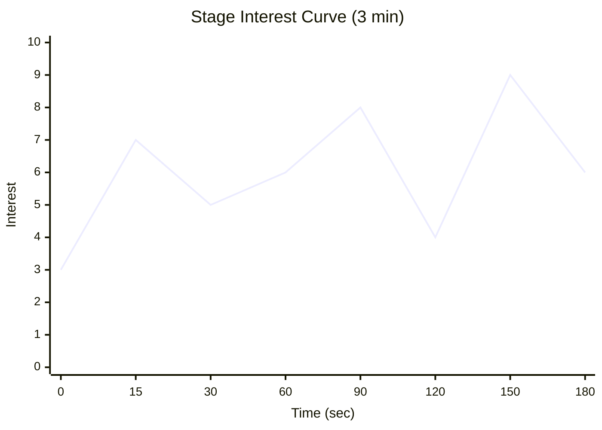
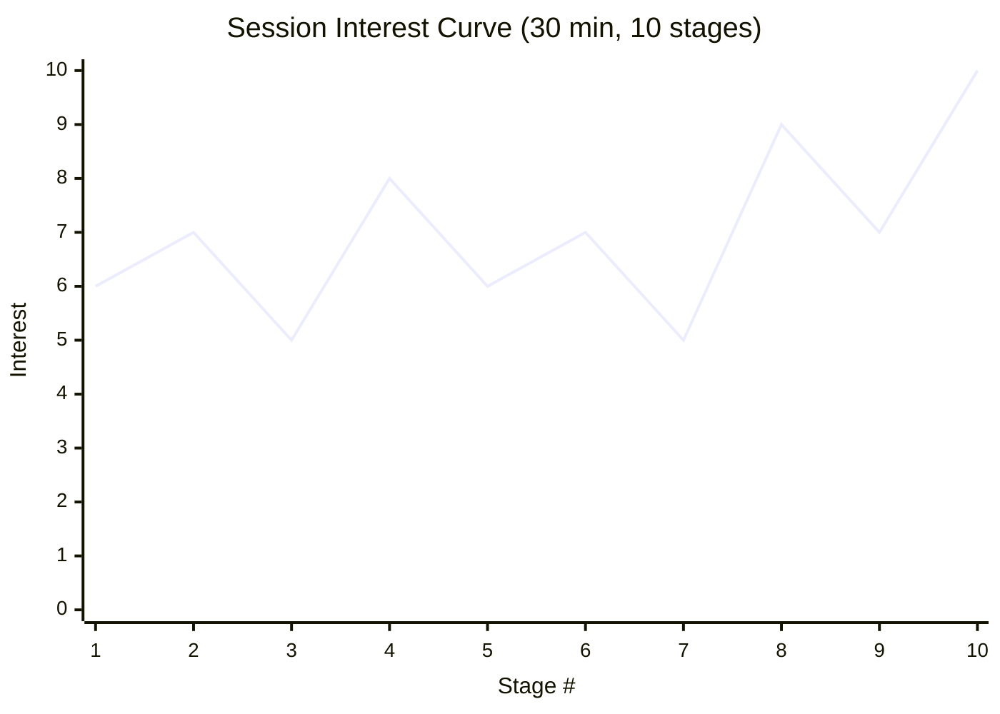

# 竜潮 / Dragon Tide

> **Game Design Document v0.1**
> 2026-05-31 / game-designer: Claude (Opus 4.7)
> 参考フレームワーク: Jesse Schell『The Art of Game Design』(Elemental Tetrad / MDA / Interest Curve / Flow / The Toy)

---

## 0. ピッチ（合言葉の翻訳）

> **指でラインを描く。竜の群れがそれをなぞって流れる。**
> **その「流れの気持ちよさ」だけで30分が溶ける、触覚的フローアクション。**

- **ジャンル**: 群体操作 × ライン・ドロー × 流体バトル
- **プラットフォーム**: HTML5 Canvas / スマホブラウザ縦持ち片手
- **セッション長**: 1ステージ 2〜5分（推奨3分） × エンドレス連戦
- **同時表示**: 自軍最大 50体（味方+敵で 100体目標、tech-lead検証中）
- **オフライン完結**: 初版はサーバ無し / IndexedDBにセーブ
- **テキスト最小**: UIはアイコン中心、ナラティブは環境演出のみ

---

## 1. Essential Experience（核心体験）

> **「指の腹から、生き物の群れの重みが流れ出していく」感覚。**
> **自分が描いた一本の線が、50体の竜の意志となって渦を巻き、敵の群れを呑み込む——その『流体を所有している』万能感と、群れがふっと自律的に動く『手放した瞬間の生命感』が交互にやってくる。**

設計上の絶対条件: **プレイヤーは「操作している」と「眺めている」の境界を曖昧に感じなければならない。** これが崩れると本作は成立しない。

---

## 2. Elemental Tetrad 分析

Jesse Schell の4要素。すべての設計変更はこの4軸への波及を確認する。

### 2.1 Mechanics（ルール / 動かす仕掛け）
- **ライン・ドロー**: 指でなぞった軌跡が群れの誘導パス（最大保持長 ~画面対角線の1.5倍）
- **Boids**: 分離 / 整列 / 結束 の3力 + プレイヤーパスへの引力
- **隊形モード3種**: 密集(Tight) / 散開(Spread) / 円環(Ring) ← トグル1タップで切替
- **属性**: 火 / 氷 / 影 の3すくみ（後述 §9）
- **孵化メタループ**: 戦闘後に獲得した「卵」を選んで群れに加える（編成）

### 2.2 Story（物語 / 出来事の順序）
- **最小限の世界観**: かつて空を満たした竜が「潮」となり地に沈んだ世界。プレイヤーは竜潮を再び空へ呼び起こす「呼び手」
- **明示的セリフ無し**。ステージ進行で空の色・雲の形・遺跡シルエットだけが変わる
- **節目演出**: 10ステージごとに群れが一斉に咆哮する1カット（中断不可・3秒）—— これだけが「物語」のリズム

### 2.3 Aesthetics（感覚 / 何が届くか）
- **視覚**: 半透明シルエットの竜が重なる「水墨×ネオン」。線の軌跡は淡く残光
- **触覚**: スマホ振動。ライン描画中は微弱な持続振動、敵接触で短いパルス
- **聴覚**: アンビエント基調。竜の数が増えるほど低音レイヤーが増える「群密度の音楽化」
- **時間感覚**: ステージタイマー非表示。「ふと顔を上げたら3分」体験を優先

### 2.4 Technology（媒体・素材）
- HTML5 Canvas 2D + WebGL fallback（パーティクル多数のため）
- Boids計算は Web Worker に逃がす（メインスレッド = 描画とタッチのみ）
- 同時50体維持のため空間ハッシュ（grid分割）で近傍探索 O(n)
- 縦持ち固定: 9:19.5 を基準、SafeArea対応
- 振動: `navigator.vibrate` ベストエフォート

> **Tetrad 整合チェック**: 「群れの密度に応じて低音が増す」(Aesthetics) は Boids近傍数(Mechanics) を音響パラメタに直結することで成立する(Technology)。物語(Story)は数値や手触りの邪魔をしない最小量に抑える。**4要素はすべて「群密度」という一本の軸で結ばれている**。

---

## 3. コアファンタジー / The Toy（玩具レンズ）

### コアファンタジー
> **「群れを率いる」ではなく「群れになる」。**
> プレイヤーは将軍ではなく、群れそのものの意志。

### The Toy: 勝敗条件を全部外しても面白いか？

**Yes、これが本作の前提**である。以下を保証する：

1. **線を描くだけで竜が追従する**——この時点で物理シミュレーション的な気持ちよさが成立する（砂・水・群衆を眺める原始的快楽）
2. **隊形トグル**を押すだけで群れの形状が変わる——形を見るだけで楽しい
3. **何もない空に円を描き続ける**と竜が巴になって渦を作る——ASMR的な無目的快楽

**実装順序の原則**: プロトタイプ最初の2週間は「敵ゼロ・スコアゼロ・無限の空」モードだけを作り、社内テストで**触り続けてしまうか**を計測する。これが Yes でなければ機能追加禁止。

---

## 4. コアループ（30秒 / 5分 / 30分の入れ子）

### 4.1 30秒ループ（マイクロ: 1エンゲージメント）
```
指で線を引く → 群れが流れる → 敵群と交差 → 隊形切替で属性発火 →
敵が散る/卵が落ちる → 指で卵を回収（線で吸い寄せ） → 次の敵へ
```
**設計意図**: 30秒に1回必ず「形を変える快感」と「触覚フィードバック」が来る。

### 4.2 5分ループ（メソ: 1ステージ）
```
ステージIN（群れ初期配置の演出 8秒） →
雑魚ウェーブ×3（30秒ループ×6回） →
中型竜1体（隊形読み合いの初登場 45秒） →
ステージOUT演出（ふっと音が引いて、卵が落ちてくる 5秒） →
編成画面（任意・スキップ可）
```
**設計意図**: 5分のうち、戦闘外（演出+編成）に約30秒。**「戦闘から戦闘」ではなく「呼吸から呼吸」**に感じさせる。

### 4.3 30分ループ（マクロ: 1セッション）
```
6〜10ステージ連戦 → 属性構成が偏ってきて手応えが変わる →
新属性の竜が解放される（孵化メタ） → 編成を組み直したくなる →
「もう1ステージだけ」が3回続く → 気づいたら30分
```
**設計意図**: セッション終了の動機を**プレイヤーに渡さない**。タイマー・スタミナ・日次クエスト等の「区切り装置」を排除し、**「群れが完成しちゃった、もう一周見たい」**で自然終了させる。

---

## 5. MDA マッピング（ルール→動的振る舞い→感情）

| Mechanics（書ける） | Dynamics（生まれる） | Aesthetics（届く） |
|---|---|---|
| 指の軌跡が群れの引力場になる | 線をS字に引くと群れが蛇行し、自然な「うねり」が出る | **流体所有感** |
| Boidsの分離力が一定以上 | 急カーブで群れが千切れて遅延する | **群れの重み・慣性** |
| 隊形トグルは0.3秒で完了 | プレイヤーが「呼吸」のタイミングで切替を始める | **手と群れの一体化** |
| 卵は線の引力で吸い寄せ可能 | 戦闘後の回収パートが「もう一筆」のリズムを保つ | **掃除的快感（無意識のリズム）** |
| 敵の群れも同Boids | 自軍が敵群を「貫通」「包囲」する物理的絵が出る | **群vs群の絵としての美しさ** |
| 編成は最大3属性のスロット | プレイヤーが偏った構成を試したがる | **試行のワクワク** |
| ステージ間に編成画面 | 思考と感覚が交互に来る | **緊張と弛緩のリズム** |

> **逆算原則**: 上記表は左から右ではなく**右から左**に設計する。「流体所有感」を作るために何が要るか? を問い続けた結果が左列。

---

## 6. Interest Curve（興味曲線）

### 6.1 ステージ単体（3分）のInterest Curve



- **0-15s**: 群れが空から舞い降りる演出（初動フック・興味7）
- **15-30s**: 最初の敵接触、軽い成功体験（一旦5に落として呼吸）
- **30-90s**: 雑魚ウェーブで「線を描く快感」を反復、緩やかに上昇
- **90-120s**: 一時的に敵がいない「凪」(意図的な凹み・興味4)
- **120-150s**: 中型竜登場、隊形読み合いのピーク（最高潮9）
- **150-180s**: ステージクリア演出、卵がふわっと落ちてくる余韻

### 6.2 セッション全体（30分）のInterest Curve



- **Stage 3, 7**: 意図的な凹み（編成見直しを誘発する難度の谷）
- **Stage 4, 8**: 新属性解放・新フォーメーション解放のピーク
- **Stage 10**: ボス級の「群れの王」、セッションのクライマックス

### 6.3 「飽き」予測と先手

| 飽きるタイミング | 兆候 | 先手の打ち手 |
|---|---|---|
| Stage 3-4 | 線を引くだけの単調感 | **属性ギミック**を Stage 3 で初登場 |
| Stage 6-7 | 隊形切替が機械的になる | **敵側が隊形を変えてくる**中型を投入 |
| 10ステージ後 | コア体験の頭打ち | **新フォーメーション(4種目)** を解放（後述） |

---

## 7. Flow Channel 設計（難易度カーブ）

### 7.1 フロー維持の3技法（Csikszentmihalyi → ゲーム化）

| 技法 | 本作での実装 |
|---|---|
| フィードバックの即時性 | 線を描いた瞬間に群れが反応(<50ms)。属性ヒットは画面フラッシュ+振動+SE3重 |
| 目標の明確さ | 敵は赤く強調、卵は金色。**HUD最小化**で迷わせない |
| 雑音の排除 | テキスト・通知・タイマー表示なし。指の下に文字を置かない |

### 7.2 難易度上昇カーブ

```
Stage 1-3:    [チュートリアル相当] スキル<挑戦 を意図的に作らない。常に余裕
Stage 4-7:    [習熟] フロー帯の真ん中。指が勝手に動く時間
Stage 8-9:    [挑戦] 一度敗北しても良い設計（後述§7.3）
Stage 10:     [カタルシス] 全スキル動員のボス戦
```

**数値仮置き（system-designer が後で調整）**:
- 敵密度: Stage N で `5 + N*2` 体/ウェーブ
- 敵速度: Stage 1=1.0倍 → Stage 10=1.6倍（線形でなく Stage 7 以降に傾斜）
- 中型出現: Stage 3, 6, 8 / ボス: Stage 10

### 7.3 失敗条件と再挑戦の心地よさ ★重要

**失敗条件**: 群れが全滅（0体）したらステージ失敗。

**フラストレーションを生まないための7つの設計**:

1. **死=即終了ではない**: 残り1体になると画面が水墨化し、最後の1体だけで30秒の「逃走モード」に移行。生き延びれば部分報酬
2. **失敗時の演出が美しい**: 群れが空に溶けていくスローモーション5秒。**失敗画面を見たいから死ぬ**プレイヤーがいるレベルを目指す
3. **再挑戦ボタンは1タップ**: モーダルなし、画面下中央に大きく
4. **失敗ペナルティなし**: スタミナ・通貨消費なし。卵だけ持ち帰れない
5. **失敗回数で難度自動調整**: 3連続失敗で敵密度-10%（プレイヤー非通知）
6. **失敗時の振動は弱く長く**: 「叩かれる」ではなく「沈む」感触
7. **直前リプレイ機能**: クリア時もリトライ時も、最後の10秒を倍速で見せる（自分の操作を客観視）

> **設計哲学**: 失敗は「叱られる」ではなく「もう一度触りたくなる」イベント。Hades の死亡演出が手本。

---

## 8. 進行設計（解放ゲート・報酬・孵化メタループ）

### 8.1 解放ゲート（プレイヤーは何を、いつ、もらうか）

| ステージ | 解放されるもの | 解放の理由 |
|---|---|---|
| 1 | 火属性のみ・密集隊形のみ | 操作の単純化、線を引くだけに集中 |
| 2 | 散開隊形 | 隊形切替の「指の動き」を体に入れる |
| 3 | 氷属性 | 属性相性の最初の発見 |
| 4 | 円環隊形 | 防御の概念導入 |
| 5 | 編成画面の解放 | ここまでは強制構成で迷わせない |
| 7 | 影属性 | 3すくみ完成、戦略の幅が一気に広がる |
| 10 | 4つ目の隊形「螺旋」 | セッション再起動の動機 |
| 15 | 群れ最大数 +10 | 視覚的にも分かるパワーアップ |

**原則**: **新要素は3ステージに1個まで**。詰め込まず、1要素を味わわせる。

### 8.2 報酬タイミング

| 報酬種類 | タイミング | 効果 |
|---|---|---|
| 卵（次のドラゴン） | 各ステージクリア時 1〜3個 | 編成の選択肢 |
| 隊形解放 | 上記ゲート | 操作幅の拡張 |
| 演出報酬 | 10ステージ毎 | 一斉咆哮カット（中断不可3秒、§2.2） |
| 「名前のない記録」 | 累計プレイ時間で自然解放 | 設定資料的小ギャラリー、テキストなし |

### 8.3 孵化メタループ（戦闘外の遊び）

**孵化フロー**:
```
卵獲得 → 編成画面（任意） → スロット3つに割当 →
余った卵は「孵化器」に保管（最大10個） → 次セッション開始時に自動孵化
```

**設計意図**:
- 「次のセッションで何が孵るか」がプレイ再開のフック
- アイドル要素（時間で進む孵化）を**最小限**だけ持ち込み、戦闘外の動機を作る
- ただし**通知は出さない**——スタミナ通知地獄にならないよう注意

---

## 9. 属性システム（火 / 氷 / 影）

### 9.1 3すくみ

```
火 → 氷を溶かす     (火 vs 氷 = 1.5倍)
氷 → 影を凍らせる    (氷 vs 影 = 1.5倍)
影 → 火を呑み込む    (影 vs 火 = 1.5倍)
同属性同士: 0.8倍（撃ち合うほど弱まる感覚）
```

### 9.2 属性 × 隊形マトリクス（仮置き）

| 隊形＼属性 | 火 | 氷 | 影 |
|---|---|---|---|
| 密集(Tight) | 貫通弾 | 凍結弾(移動低下) | 暗黒槍(防御無視) |
| 散開(Spread) | 範囲炎上(継続Dmg) | 範囲スロウ | 範囲視界低下 |
| 円環(Ring) | 炎の盾(接触Dmg) | 氷の盾(反射) | 影の盾(被弾減) |

**9パターン**= プレイヤーが「自分の手で発見する組み合わせ」を9個用意する。チュートリアルでは1〜2個しか教えない。

### 9.3 編成の制約

- 群れ最大50体に対し、スロット3（各最大17体程度）
- **同属性100%編成は弱い**ようにバランス（色々試させたい）
- ロックなし、いつでも編成変更可（戦闘中以外）

---

## 10. 隊形切替UI（縦持ち片手操作）

### 10.1 レイアウト原則

```
+---------------------+
|                     |
|                     |
|    [ゲーム画面]      |  ← 上70%は完全クリア。指が画面を覆うので
|                     |    上半分にUI要素を置かない
|                     |
|                     |
|     ・ ・ ・        |  ← 余韻のドット（味方残数表示・極小）
+---------------------+
|  [火] [氷] [影]     |  ← 下部20%: 属性切替（左手親指届く位置）
| [密][散][円]  [⟳]   |  ← 下部10%: 隊形+リトライ
+---------------------+
```

### 10.2 片手操作の動線

- **親指1本だけ**で全操作完結する設計
- 指の腹は**ライン描画専用**、押し始めの位置で操作を判定
  - 画面下20%エリアから始まる → ボタン操作
  - それ以外から始まる → ライン描画
- 隊形ボタンは**3つを画面端寄りに密集配置**（親指の届く扇形）
- 属性切替は**長押しでラジアルメニュー**にして、ライン描画と誤爆しない

### 10.3 アイコン設計（i18n対応）

- 火 = 三角の炎、氷 = 六角結晶、影 = 半月
- 隊形 = 点配置の幾何アイコン（密集=●、散開=∴、円環=○）
- **文字は一切使わない**。チュートリアルもパントマイム的ハンドジェスチャ動画で

---

## 11. ゲームフィール言語化（指がどう気持ちいいか）

> **このセクションは tech-lead と graphics-engineer に渡す、感触の仕様書である。**

### 11.1 線を描く瞬間（タッチ開始 ~ 100ms）

- 指先の真下に**淡い光のリング**（半径20px、不透明度→30%）が即時出現
- 振動: 10ms 弱パルス（「触れた」を体に返す）
- 群れは**まだ動かない**——0.1秒の「ため」を作って、群れが「気づく」感覚

### 11.2 線を引いている最中（持続）

- 軌跡は**水墨が滲むように残り**、1.2秒で消える
- 群れの先頭が線を**追いかけ始める時、わずかに減速→加速**（慣性感）
- 線がカーブしたとき、群れの後方が遅れて**「鞭のしなり」**を見せる
- 持続振動: 6Hz の極弱バイブ（指の腹に「群れの呼吸」を感じさせる）

### 11.3 隊形切替の瞬間

- ボタン押下から**0.15秒**で群れが新隊形に再配置開始
- 再配置は**個体ごとに微小なランダム遅延**（一斉でなく「ざわっ」と）
- 振動: 30ms 中パルス + 切替SE
- 画面全体に**0.1秒の薄いフラッシュ**（属性色）

### 11.4 敵接触・属性発火

- ヒット時: **画面振動なし**（カメラを揺らさない哲学）
- 代わりに**敵が砕け散るパーティクル**を派手に
- 振動: 20ms 強パルス
- 効果音は**短く乾いた音**（持続音は群れの低音レイヤーに譲る）

### 11.5 「指を離したくなくなる」3つの仕掛け

1. **線の余韻**: 指を離しても1.2秒は群れが直前の線を覚えている → **「あと一筆」**を誘発
2. **群れの自律性**: 何もしないと群れがゆっくり旋回する → **眺める時間が成立**
3. **次の卵の予告**: ステージ後半で「次に落ちそうな卵の色」がうっすら見える → **次への興味を勝手に作る**

---

## 12. 参考タイトルと差別化

### 12.1 参考タイトル

| 作品 | 学ぶ要素 |
|---|---|
| **flOw** (thatgamecompany) | 無目的快楽、Aestheticの極致、難易度の自己選択 |
| **Flower** (thatgamecompany) | 群れ(花弁)の物理的気持ちよさ、テキストレス世界観 |
| **Osmos** | 物理シミュレーションの「触り続けたさ」、ゆっくり時間 |
| **Galcon** | 群体ストラテジー、スワイプ1つで指示する潔さ |
| **Spore (Cell stage)** | 群れの編成と「次の進化」への期待 |
| **Pikmin** | 群れを率いる愛着、損失の悲しさ |
| **Patapon** | 隊形/モード切替のリズム性 |
| **Vampire Survivors** | 「もう一周」のループ設計、最小UI |

### 12.2 差別化（5つの独自性）

1. **指で群れを"なぞる"**: タップ・スワイプ命令型(Galcon)でなく**連続的なパス描画**——筆の文化
2. **隊形 = 攻撃属性**: 形状切替が戦略でなく**感覚的なスイッチ**になっている
3. **テキストゼロのナラティブ**: i18n コストゼロで世界中に届く
4. **群れの音楽化**: 群密度がBGMレイヤー化、**プレイが作曲**になる
5. **失敗が美しい**: 失敗演出のクオリティで**死ぬのが楽しい**を実現

### 12.3 持ち込まないもの（プロデューサー指示）

- ❌ クラフト要素 / 素材集め
- ❌ 長文ナラティブ / カットシーン
- ❌ ガチャ / 課金導線（初版は完全買い切り or 広告なし無料）
- ❌ オンライン対戦 / ランキング（初版）
- ❌ スタミナ・日次クエスト等の「区切り装置」

---

## 13. Open Questions（未解決問題）

### 13.1 game-designer から問いたいこと

1. **片手操作 vs 両手操作**: 現状は片手前提だが、隊形+属性+ライン同時操作の負荷が高すぎないか? **両手モード**を別に用意すべきか? → ui-ux-designer 検証希望
2. **エンドコンテンツ**: 30ステージ以降、何でリテンションを保つか? メタ要素(孵化)だけで持つか? → producer 判断
3. **PvP誘惑**: 群れvs群れは PvP に向くが、初版見送りで本当に良いか? → 開発リソース次第
4. **音ゲー化リスク**: 隊形切替の気持ちよさを追求すると Patapon化(リズムゲー化)する可能性。**故意にズラせる**自由度を残すべきか?

### 13.2 他エージェントへの委譲

| 委譲先 | 内容 |
|---|---|
| **tech-lead** | 同時50体 × Boids計算 × Canvas2D描画 の実機FPS検証（特に廉価Android） |
| **system-designer** | §7.2 の難度数値・§9.2 の属性倍率の精緻化 |
| **ui-ux-designer** | §10 の片手UIレイアウト試作と Fitts則検証 |
| **audio-director** | §2.3「群密度の音楽化」の具体的音源レイヤー設計 |
| **graphics-engineer** | §11 ゲームフィール仕様の Canvas2D 実装可能性 |
| **qa-engineer** | §7.3 失敗フローの感情測定（プレイテスト設計） |

### 13.3 プロトタイプで最初に検証すべき仮説

> **「敵ゼロ・スコアゼロ・無限の空モード」だけで、社内テスターが平均3分以上触り続ける**

これが No なら、本GDDの前提は崩壊する。**2週間で検証し、結果次第でリピボ可能**な計画を立てる。

---

## 14. 次のアクション

- [ ] producer: 本GDDレビュー & priorities確定
- [ ] tech-lead: 同時50体性能検証 PoC (1週間)
- [ ] game-designer (自分): The Toy 検証プロトのワイヤー作成
- [ ] ui-ux-designer: 片手操作レイアウト3案
- [ ] system-designer: 数値テーブル `data/balance/dragon-tide.json` 雛形

---

*— end of GDD v0.1 —*
