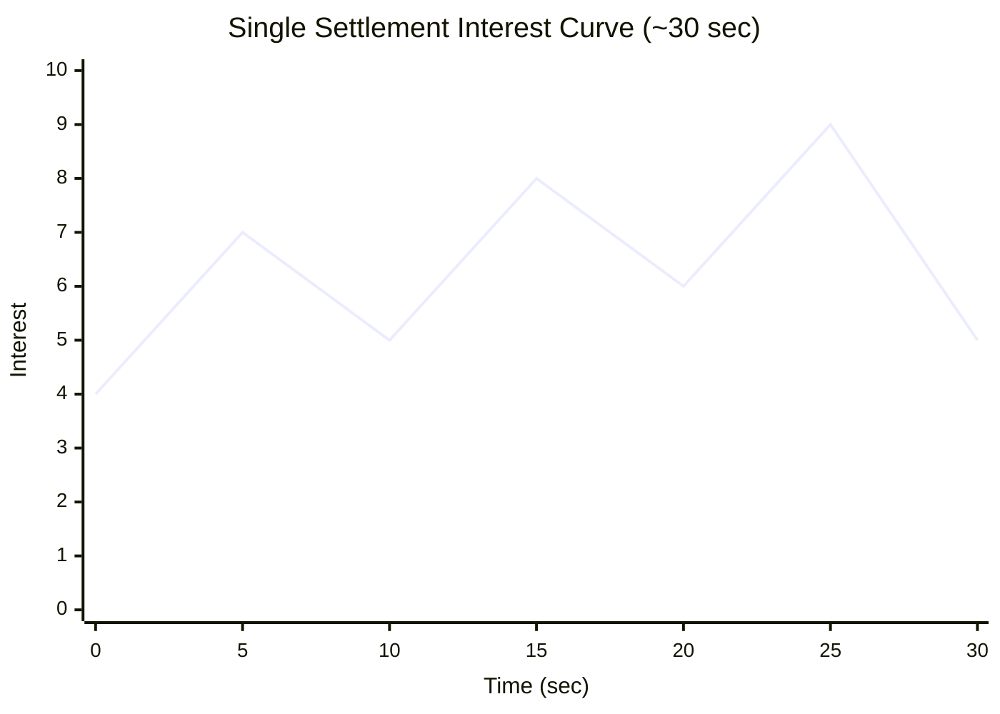
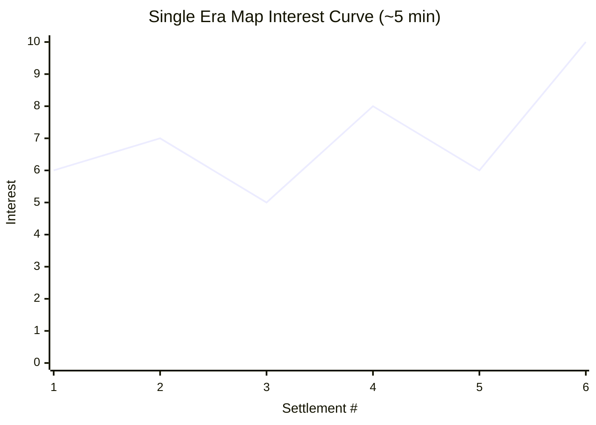
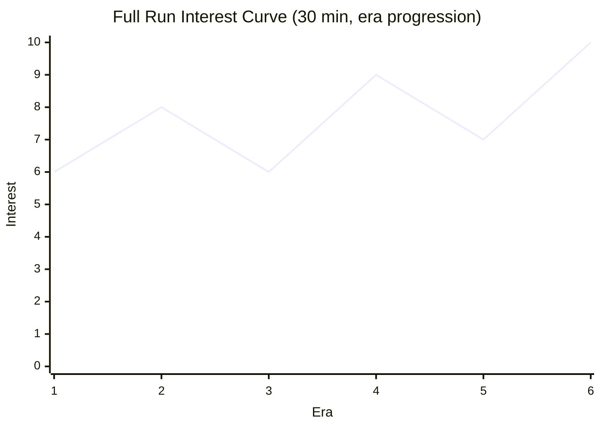

# 竜潮 / Dragon Tide

> **Game Design Document v0.2**
> 2026-06-04 / game-designer: Claude (Opus 4.8)
> 参考フレームワーク: Jesse Schell『The Art of Game Design』(Elemental Tetrad / MDA / Interest Curve / Flow / The Toy)
>
> **v0.2 大改訂の方針（producer 指示）**:
> 「移動する敵群 vs プレイヤー群」を**廃棄**し、**「竜の群れが歴史の中を旅して文明を蹂躙する」**へ転換。
> 敵は**動かない集落・町・城**。マップは**ループではなく広いスクロールマップ**。
> 確定要素として **指のライン誘導 / 隊形3種 × 属性3種 / 卵孵化メタ / Canvas / 縦持ち / テキストゼロ / PvPなし** は維持。

---

## 0. ピッチ（合言葉の翻訳）

> **指でラインを描く。竜の群れがそれをなぞって、地上の文明へなだれ込む。**
> **石器時代の村から近世の要塞まで——歴史を縦断しながら、群れが世界を呑み込んでいく触覚的フローアクション。**

- **ジャンル**: 群体操作 × ライン・ドロー × 文明蹂躙ローグライト
- **プラットフォーム**: HTML5 Canvas / スマホブラウザ縦持ち片手
- **セッション長**: 1ラン（1つの時代）3〜6分 × 時代連鎖でエンドレス
- **同時表示**: 自軍最大 50体 + 集落の防衛弾幕（tech-lead検証中）
- **オフライン完結**: 初版はサーバ無し / IndexedDBにセーブ
- **テキスト最小**: UIはアイコン中心、ナラティブは環境・建築のシルエットのみ

> **v0.1 からの最大の変化**: 敵が「向かってくる群れ」から「待ち構える文明」になったことで、ゲームは
> **「すれ違い様の戦闘」から「攻城戦の連続」**へ変わる。プレイヤーは**捕食者**になり、世界は**獲物**になる。

---

## 1. Essential Experience（核心体験）

> **「指の腹から、生き物の群れの重みが流れ出していく」感覚は維持する。**
> **その群れが、地上にうずくまる人間の営み——村、都市、城——へ津波のように覆いかぶさり、`竜潮`の名の通り、文明を呑み込んで引いていく。**
> **プレイヤーが感じるべきは『流体を所有している万能感』と、それで『一つの世界を上から消していく加害的な高揚』の二重奏。**

設計上の絶対条件（v0.1から継承）: **プレイヤーは「操作している」と「眺めている」の境界を曖昧に感じなければならない。**

v0.2で追加する絶対条件: **「呑み込んだ」という結果が必ず地上に残らなければならない。** 制圧した集落は**廃墟・更地・焼け跡**としてマップに刻まれ、群れが通り過ぎた後の世界は**目に見えて変わっている**。蹂躙の高揚は「跡が残る」ことで初めて成立する。

---

## 2. Elemental Tetrad 分析

Jesse Schell の4要素。すべての設計変更はこの4軸への波及を確認する。

### 2.1 Mechanics（ルール / 動かす仕掛け）
- **ライン・ドロー**（維持）: 指でなぞった軌跡が群れの誘導パス（最大保持長 ~画面対角線の1.5倍）
- **Boids**（維持）: 分離 / 整列 / 結束 の3力 + プレイヤーパスへの引力
- **隊形モード3種**（維持）: 密集(Tight) / 散開(Spread) / 円環(Ring) ← トグル1タップで切替
- **属性**（維持）: 火 / 氷 / 影 の3すくみ（§9）
- **孵化メタループ**（維持）: 制圧した集落から得た「卵」を編成に組み込む
- **★新規: 集落 = 静的拠点**: マップ上に固定配置。**HPゲージ**（城壁・人口）を持ち、削りきると陥落
- **★新規: 防衛弾幕**: 集落が群れに向けて投射物（矢・石・砲弾）を放つ。集落種類ごとにパターンが違う（§5）
- **★新規: スクロールマップ & ルート選択**: カメラが群れを追う広域マップ。プレイヤーは次に向かう集落を**自分で選ぶ**
- **★新規: 時代遷移**: マップ端の「時代の境界」を越えると次の時代へ（石器→古代→中世→近世…§6）

### 2.2 Story（物語 / 出来事の順序）
- **最小限の世界観**: 竜は時を超えて生きる「潮」。人間の文明は興っては滅ぶが、竜の群れは時代から時代へ渡り、そのたびに地上を呑む
- **明示的セリフ無し**。時代が進むと**建築様式・地上の色・空の汚れ**だけが変わる（石器時代=土と緑 → 近世=灰色と煙）
- **節目演出**: 時代を越える瞬間だけ、群れが雲を突き抜ける**3秒のトランジションカット**（中断不可）——これが「物語」のリズム
- **加害の暗喩**: テキストは無いが、近世以降の集落ほど「人間が空を撃ち返してくる」ことで、**人類の抵抗の進化**が静かに語られる

### 2.3 Aesthetics（感覚 / 何が届くか）
- **視覚**（維持+拡張）: 半透明シルエットの竜が重なる「水墨×ネオン」。**地上の集落は対照的に精緻なミニチュア建築**として描き、群れの抽象性と対比させる
- **触覚**: スマホ振動。ライン描画中は微弱な持続振動、城壁突破・集落陥落で**長く深いパルス**（「呑んだ」手応え）
- **聴覚**: アンビエント基調。群密度で低音が増す（維持）。集落の防衛が激しいほど**地上から金属音・砲声レイヤー**が乗る
- **時間感覚**: マップ探索でタイマー非表示。「次の集落だけ落としたら」が積み重なる

### 2.4 Technology（媒体・素材）
- HTML5 Canvas 2D + WebGL fallback（パーティクル + 弾幕多数のため）
- Boids計算は Web Worker。**弾幕の当たり判定も空間ハッシュに相乗り**
- **スクロールマップ**: 群れを中心にカメラ追従。マップは画面の3〜5倍程度（§3で詳述）
- 縦持ち固定: 9:19.5 を基準、SafeArea対応
- 振動: `navigator.vibrate` ベストエフォート

> **Tetrad 整合チェック**: v0.2では4要素が**「呑み込む」という一本の軸**で結ばれる。
> 静的集落(Mechanics)が防衛弾幕を放ち、それを隊形で凌いで城壁を割る(Mechanics)と、地上に廃墟が残り(Aesthetics)、低音と砲声が引いて静寂が訪れる(Aesthetics)。
> 時代を越えるほど弾幕が高度化し(Mechanics/Technology)、人類の抵抗史(Story)が手触りとして語られる。

---

## 3. コアファンタジー / The Toy（玩具レンズ）

### コアファンタジー
> **「群れを率いる」ではなく「群れになる」。そして「世界を上から消していく」。**
> プレイヤーは将軍ではなく、群れそのものの意志であり、文明にとっての災害そのもの。

### The Toy: 勝敗条件を全部外しても面白いか？

**Yes、これが本作の前提**である（v0.1から継承・強化）：

1. **線を描くだけで竜が追従する**——物理シミュレーション的な気持ちよさ（砂・水・群衆を眺める原始的快楽）
2. **隊形トグル**を押すだけで群れの形状が変わる——形を見るだけで楽しい
3. **何もない空に円を描き続ける**と竜が巴になって渦を作る——ASMR的な無目的快楽
4. **★新規: 群れを集落の上に重ねるだけで気持ちいい**——大量の竜のシルエットが小さな建築をすっぽり覆い隠す**スケールの落差**。勝敗を取り除いても「覆いかぶさる」絵そのものが快楽

**実装順序の原則**（維持）: プロトタイプ最初の2週間は「**動かない集落1つ + 無限の空**」モードで、**群れを集落に重ねる/離すだけで触り続けてしまうか**を計測。これが Yes でなければ機能追加禁止。

---

## 4. コアループ（30秒 / 5分 / 30分の入れ子）

### 4.1 30秒ループ（マイクロ: 1集落の攻略）★全面改訂

```
集落に近づく → 集落が防衛弾幕を放ち始める（矢/石/砲弾） →
弾幕の種類を読む → 隊形を切り替えて凌ぐ（円環で矢を弾く等） →
城壁の弱点に群れを叩き込む（密集で集中突破） →
城壁が割れる → 集落HPが急減 → 陥落（建築が崩れ、卵が舞い上がる） →
卵を線で回収 → 次の集落へカメラが流れる
```

**設計意図**: 30秒に1回必ず「**弾幕を読む → 隊形で答える → 突破する**」の起承転結が来る。
v0.1の「すれ違い戦闘」と違い、**1集落が1つの小さな攻城ドラマ**になる。

### 4.2 5分ループ（メソ: 1つの時代マップ）★全面改訂

```
時代マップにIN（群れ降臨の演出 8秒） →
マップ上に集落が点在（小村2〜3、中都市1〜2、拠点城1） →
プレイヤーがルートを選んで移動 → 30秒ループ ×4〜6集落 →
道中に地形（山・川）で迂回や群れの分断 →
最後に「時代の主城」（その時代のボス級拠点）→
主城陥落 → マップ端の「時代の境界」が開く
```

**設計意図**: 5分の中で**「どの集落から落とすか」という小さな戦略**が生まれる。
弱い村で群れを増やしてから城に挑むか、いきなり城に突っ込むか。**ルート選択がリスク管理**になる。

### 4.3 30分ループ（マクロ: 1ラン = 時代縦断）★全面改訂

```
石器時代マップ制覇 → 時代境界トランジション（3秒カット） →
古代文明マップ（弾幕が重く・多くなる / 新属性の卵が出る） →
編成を組み直したくなる → 中世マップ（矢の雨・熱湯・大砲） →
「次の時代の集落、どんな防衛だろう」→ 近世要塞（銃・砲撃） →
群れが消耗 → どこまで時代を進められるか（到達時代がスコア）
```

**設計意図**: セッション終了の動機を**プレイヤーに渡さない**。スタミナ・日次クエスト等の区切り装置を排除。
**「次の時代の景色が見たい」「あと1時代だけ進めたい」**で自然に30分が溶ける。
**到達時代 = 実質的なハイスコア**だが、数字ではなく**通り過ぎた文明の数**として情緒的に提示。

---

## 5. 集落の防衛メカニクス ★新規セクション

### 5.1 集落 = 静的な「弾幕を撒く獲物」

集落は移動しない。代わりに以下を持つ：

- **HP（城壁/人口）**: 群れの攻撃で削る。0で陥落
- **弱点**（任意）: 城門・物見櫓など。そこを叩くとHP減が加速（密集隊形で狙う対象）
- **防衛投射物**: 一定間隔で群れへ弾を放つ。**集落種類ごとにパターン・速度・密度が違う**
- **制圧範囲**: 群れが上空に滞在し続けると徐々にHPが減る（=「呑み込み続ける」DoT）

### 5.2 防衛手段 × 時代の対応表

| 集落種類 | 時代 | 防衛投射物 | 弾の特性 | 有効な隊形 |
|---|---|---|---|---|
| 石器の村 | 石器時代 | 炎の弓矢 | 遅い・少ない・単発 | どれでも可（チュートリアル相当） |
| 巨石遺跡の祭祀場 | 古代 | 投石（山なり） | 遅いが重い・着弾範囲ダメージ | **散開**（範囲弾を散る） |
| 古代都市 | 古代 | 石弓・大型投石機 | 中速・重い・狙い撃ち | **散開**（単発大型を回避） |
| 中世城塞 | 中世 | 矢の雨 + 熱湯 | 速い・面で降る・密度高 | **円環**（密集守備で弾く） |
| 中世城塞（後期） | 中世 | 矢の雨 + 初期大砲 | 速い面攻撃 + 遅い大弾 | **円環⇄散開の切替** |
| 近世要塞 | 近世 | 銃撃斉射 + 砲撃 | 非常に速い・斉射でライン状 | **散開**主体 + 突破時だけ密集 |
| 産業時代の工廠 | 近代（拡張） | 機関砲・対空弾幕 | 高速連射・面制圧 | 全隊形を秒で切替（最高難度） |

### 5.3 隊形 × 防衛の三すくみ的関係（コアの戦術ループ）

```
円環(Ring)   → 「面で降る弾」（矢の雨・斉射）に強い。密集守備で外周が弾を受け、内側を守る
散開(Spread) → 「単発の大型弾」（投石・砲撃）に強い。当たり判定が散るので大弾を避けやすい
密集(Tight)  → 攻撃特化。城壁・弱点への集中突破に強いが、弾には最も脆い
```

**設計意図（MDAの逆算）**:
- 感情(A) = **「来る弾を見て、とっさに形を変える俊敏な快感」**
- 動的振る舞い(D) = プレイヤーが**集落に近づいた瞬間に弾種を読み、攻めと守りを天秤にかける**
- ルール(M) = 弾種ごとに有効隊形を変え、**「攻撃に最適な密集は防御に最弱」**というジレンマを埋め込む

> **重要なジレンマ設計**: 密集は突破に最強だが弾に最弱。
> プレイヤーは「**いつ守りを捨てて突っ込むか**」を毎集落で判断する。これが30秒ループの心臓。

### 5.4 陥落の演出（蹂躙の報酬）

- 城壁が割れる瞬間: **建築が内側へ崩落するパーティクル** + 深く長い振動
- 集落の色が抜けて**灰色の廃墟**に変わる
- 卵が複数、ゆっくり舞い上がる（回収パート）
- 地上から上がっていた防衛音レイヤーが**ふっと消える**（静寂のごほうび）

---

## 6. 時代・文明の設計 ★新規セクション

「時代を越える」＝**難易度上昇 × 新しい視覚体験 × 新属性卵**を同時に供給する装置。

### 6.1 時代テーブル（6段階 + 拡張）

| # | 時代 | 外観（地上） | 空・色調 | 主な防衛 | 落ちる卵（新属性/亜種） | 時代の主城 |
|---|---|---|---|---|---|---|
| 1 | 石器時代 | 土の村・木の柵・焚き火 | 澄んだ青空・緑 | 炎の弓矢 | **火**（基本） | 巨大な木組みの砦 |
| 2 | 古代文明 | 石造神殿・ピラミッド・列柱 | 砂塵の金色 | 投石・石弓 | **氷**（解放） | 神殿都市（投石機林立） |
| 3 | 中世 | 石の城・城壁・尖塔 | 曇天・灰青 | 矢の雨・熱湯 | **影**（解放）/ 火の亜種 | 大城塞（矢の雨が常時） |
| 4 | 大航海・近世 | 星形要塞・港・帆船 | 硝煙の白 | 銃撃・砲撃 | 氷の亜種（凍結強化） | 海上要塞 |
| 5 | 産業時代 | 煉瓦工場・煙突・鉄道 | 煤けた橙灰 | 機関砲・対空弾幕 | 影の亜種（隠密強化） | 大工廠（弾幕地獄） |
| 6 | 蒸気幻想（拡張枠） | 浮遊都市・歯車要塞 | 蒸気の虹色 | レーザー網・誘導弾 | 第4属性「雷」候補 | 天空城 |

> **Open Question候補**: 6以降は「現代/未来」へ進めるか、それとも**蒸気幻想で打ち止め**にして周回難度上昇に切り替えるか（§13）。

### 6.2 各時代の「らしさ」3点セット

各時代は必ず**(A)外観 (B)防衛の手触り (C)報酬の卵**で差別化する：

- **石器**: のどかな緑、矢はパラパラ落ちる程度、火の卵 → **「無双できる導入」**
- **古代**: 黄金の威容、投石が山なりに落ちてくる重さ、氷の卵 → **「重い一撃を散開で避ける学び」**
- **中世**: 灰色の圧迫、矢の雨が面で降る、影の卵 → **「円環で耐える防御戦の本格化」**
- **近世**: 硝煙と直線、銃の斉射がライン状に走る、凍結強化卵 → **「速さへの適応」**
- **産業**: 煤と鉄、弾幕が画面を埋める、隠密強化卵 → **「全隊形を秒単位で回す熟練の試練」**
- **蒸気幻想**: 異世界の色彩、誘導弾という新ルール、雷の卵 → **「ルールが変わる驚き」**

### 6.3 難易度と視覚の二重カーブ

時代が進むほど **(1)弾幕が速く・多く・面化** し、同時に **(2)景色が一変** する。
これにより「**難しくて緊張する**」と「**新しくて見たい**」が同時に上がり、Flow帯を維持しながら興味の谷を作らせない。

---

## 7. MDA マッピング（ルール→動的振る舞い→感情）

| Mechanics（書ける） | Dynamics（生まれる） | Aesthetics（届く） |
|---|---|---|
| 指の軌跡が群れの引力場になる（維持） | S字に引くと群れが蛇行しうねる | **流体所有感** |
| 集落が弾種ごとに固有弾幕を放つ | プレイヤーが接近時に弾を読んで隊形を選ぶ | **戦術的瞬発の快感** |
| 密集＝最大火力／最弱防御 | 「いつ守りを捨てて突っ込むか」の賭け | **緊張とカタルシス** |
| 制圧で集落が廃墟化しマップに残る | プレイヤーが通過跡を振り返る | **加害的高揚・支配の実感** |
| マップに集落が点在しルート自由 | 弱い村で増えてから城へ等の道順最適化 | **小さな戦略の知的満足** |
| 山・川が群れを分断/迂回させる | 群れがちぎれて慌てて線を引き直す | **群れの脆さへの愛着** |
| 時代境界で景色と弾幕が一変 | 「次の時代が見たい」連鎖 | **発見と更新の期待** |
| 制圧で得た卵を編成（孵化メタ） | 偏った属性構成を試したがる | **試行のワクワク** |

> **逆算原則**（維持）: 右列の感情から左列のルールを設計する。
> v0.2の新しい目的地は **「支配の実感」**——だからこそ「跡が残る」「景色が変わる」ルールが必要になった。

---

## 8. Interest Curve（興味曲線）★再設計

### 8.1 1集落（30秒）のInterest Curve



- **0-5s**: 集落が見え、弾幕が起動（フック・興味7）
- **5-10s**: 弾を読み隊形選択、一旦落ち着く（呼吸・5）
- **10-15s**: 弾幕を凌ぎながら接近（緊張上昇・8）
- **15-20s**: 守りを捨てて密集突撃の決断（賭けの瞬間・6で“ため”）
- **20-25s**: 城壁突破・HP急減（最高潮・9）
- **25-30s**: 陥落と卵回収の余韻（5へ収束）

### 8.2 1つの時代マップ（5分）のInterest Curve



- **集落1-2**: 小村で群れを増やす導入（緩やかな上昇）
- **集落3**: 地形（山/川）で群れが分断される凹み（意図的な谷・5）
- **集落4-5**: 中都市で弾幕が本格化（再上昇）
- **集落6（時代の主城）**: その時代のクライマックス（10）→ 時代境界が開く

### 8.3 1ラン（30分・時代縦断）のInterest Curve



- **石器(1)**: 無双の快感で入る（6）
- **古代(2)**: 氷解放 + 投石の新手触り（ピーク8）
- **中世(3)**: 矢の雨で消耗、編成見直しの谷（6）
- **近世(4)**: 影も揃い戦術が花開く（ピーク9）
- **産業(5)**: 弾幕地獄で再び消耗（7）
- **蒸気幻想(6)**: ルールが変わる驚きのクライマックス（10）→ 余韻で次ランへ

### 8.4 「飽き」予測と先手

| 飽きるタイミング | 兆候 | 先手の打ち手 |
|---|---|---|
| 古代後半 | 攻城手順が定型化 | **地形による群れ分断**を導入し空間管理を要求 |
| 中世 | 矢の雨で守り一辺倒の単調 | **大砲（散開要求）を混ぜ**、隊形の切替頻度を上げる |
| 近世以降 | 弾幕への対処が頭打ち | **誘導弾という新ルール**（蒸気幻想）で前提を崩す |
| ラン全体の中だるみ | 景色の慣れ | **時代境界の3秒トランジション**で視覚をリセット |

---

## 9. Flow Channel 設計（難易度カーブ）

### 9.1 フロー維持の3技法（維持）

| 技法 | 本作での実装 |
|---|---|
| フィードバックの即時性 | 線描画に群れが即反応(<50ms)。弾被弾・城壁突破は画面演出+振動+SE3重 |
| 目標の明確さ | 集落は地上で目立つ。**次に落とせる集落をうっすらハイライト**。HUD最小化 |
| 雑音の排除 | テキスト・通知・タイマー表示なし。指の下に文字を置かない |

### 9.2 難易度上昇カーブ（時代ベース）

```
石器:    [チュートリアル] スキル>挑戦。無双感で操作を体に入れる
古代:    [習熟] 投石回避で散開を学ぶ。フロー帯の入り口
中世:    [挑戦] 矢の雨で円環必須。守備の本格化
近世:    [熟練] 速い銃撃で隊形切替の俊敏さを要求
産業:    [高難度] 弾幕地獄。全隊形を秒で回す
蒸気幻想: [カタルシス/新ルール] 誘導弾で前提が変わる
```

**数値仮置き（system-designer が後で調整）**:
- 集落HP: 時代Nで `base * (1 + 0.4*N)`、主城は同時代小村の3倍
- 弾速: 石器=1.0倍 → 近世=2.2倍、産業=2.6倍（中世以降に傾斜）
- 弾密度（同時飛翔数）: 石器=2 → 中世=8 → 産業=20（面攻撃化）
- 群れ消耗: 被弾1発で1〜3体ロスト、制圧で卵→孵化で補充（収支が時代後半でマイナスに傾く）

### 9.3 失敗条件と再挑戦の心地よさ（維持・文脈更新）

**失敗条件**: 群れが全滅（0体）したらラン終了。**到達時代がそのランの記録**。

**フラストレーションを生まないための設計**（v0.1から継承）:
1. **死=即終了ではない**: 残り1体で水墨化し、最後の1体の30秒「逃走モード」。生き延びれば次集落で再増殖の猶予
2. **失敗時の演出が美しい**: 群れが空に溶けるスローモーション5秒。**通り過ぎた廃墟群を背景に**することで「ここまで呑んだ」を可視化
3. **再挑戦は1タップ**: 「同じ時代から再挑戦」か「最初から」を選択（モーダル最小）
4. **失敗ペナルティなし**: 孵化器の卵は保持。失っても痛くない
5. **失敗回数で難度自動調整**: 同一時代3連敗で弾密度-10%（非通知）
6. **失敗時の振動は弱く長く**: 「沈む」感触
7. **直前リプレイ**: 最後の10秒を倍速で見せる

> **設計哲学**（維持）: 失敗は「叱られる」ではなく「もう一度触りたくなる」イベント。

---

## 10. 進行設計（解放ゲート・報酬・孵化メタループ）

### 10.1 解放ゲート（時代ベースに再編）

| 到達時代 | 解放されるもの | 解放の理由 |
|---|---|---|
| 石器（1集落目） | 火属性・密集隊形のみ | 操作の単純化、線を引くことに集中 |
| 石器（2集落目） | 散開隊形 | 投石（古代）前に回避の指運動を入れる |
| 古代 | 氷属性 | 属性相性の最初の発見 |
| 古代（主城前） | 円環隊形 | 中世の矢の雨に備えた防御概念の導入 |
| 中世 | 編成画面の本格解放 | ここまでは半強制構成で迷わせない |
| 近世 | 影属性 | 3すくみ完成、戦略の幅が一気に広がる |
| 産業 | 4つ目の隊形「螺旋」 | 弾幕地獄に対する新解 + ラン再起動の動機 |
| 蒸気幻想 | 群れ最大数 +10 / 第4属性候補 | 拡張コンテンツのフック |

**原則**（維持）: **新要素は1時代に1個まで**。詰め込まず1要素を味わわせる。

### 10.2 報酬タイミング

| 報酬種類 | タイミング | 効果 |
|---|---|---|
| 卵（次のドラゴン） | 各集落陥落時 1〜3個 | 編成の選択肢・群れの補充 |
| 新属性/亜種卵 | 時代到達時 | 新時代の手応えに対応する新装備 |
| 隊形解放 | 上記ゲート | 操作幅の拡張 |
| 演出報酬 | 時代越えごと | 雲を突き抜ける3秒トランジション |
| 「呑み込んだ文明の記録」 | 制圧した集落が無言で図録化 | テキストなしの建築シルエットギャラリー |

### 10.3 孵化メタループ（維持）

```
集落陥落で卵獲得 → 編成画面（任意） → スロット3つに割当 →
余り卵は「孵化器」に保管（最大10個） → 次ラン開始時に自動孵化
```

**設計意図**（維持）: 「次のランで何が孵るか」が再開フック。アイドル要素は最小限。**通知は出さない**。

---

## 11. 属性システム（火 / 氷 / 影）※集落戦への適合

### 11.1 3すくみ（維持）

```
火 → 氷を溶かす     (火 vs 氷 = 1.5倍)
氷 → 影を凍らせる    (氷 vs 影 = 1.5倍)
影 → 火を呑み込む    (影 vs 火 = 1.5倍)
同属性同士: 0.8倍
```

> **v0.2の調整**: 集落自体は無属性だが、**時代ごとに「相性の良い属性」**を設定して攻略の偏りを作る。
> 例: 古代の石造建築は **火（高熱で石を脆く）** が有効、中世の木造構造は **影（侵食）**、近世の金属要塞は **氷（脆性破壊）**。
> これにより「この時代にはこの卵を編成したい」という**孵化メタとの接続**が生まれる。

### 11.2 属性 × 隊形マトリクス（集落戦に再解釈）

| 隊形＼属性 | 火 | 氷 | 影 |
|---|---|---|---|
| 密集(Tight) | 城壁貫通弾 | 城門凍結（弱点露出） | 防御無視の侵食槍 |
| 散開(Spread) | 範囲炎上（建築継続Dmg） | 範囲スロウ（防衛弾減速） | 範囲視界低下（弾の精度低下） |
| 円環(Ring) | 炎の盾（接近弾を焼く） | 氷の盾（飛来弾を反射） | 影の盾（被弾減・隠密） |

**9パターン**= プレイヤーが「自分の手で発見する組み合わせ」。チュートリアルでは1〜2個しか教えない。

### 11.3 編成の制約（維持）

- 群れ最大50体に対しスロット3（各最大17体程度）
- 同属性100%編成は弱め（色々試させたい）
- ロックなし、いつでも編成変更可（戦闘中以外）

---

## 12. 操作・UI（縦持ち片手）※マップ移動を追加

### 12.1 レイアウト原則（維持＋カメラ）

```
+---------------------+
|                     |
|   [スクロールマップ]  |  ← 上70%クリア。カメラが群れを追う
|    群れ + 集落 + 地形 |
|                     |
|     ・ ・ ・        |  ← 味方残数ドット（極小）
+---------------------+
|  [火] [氷] [影]     |  ← 属性切替（親指届く位置）
| [密][散][円]  [⟳]   |  ← 隊形 + リトライ
+---------------------+
```

### 12.2 マップ移動と片手操作

- **群れを線で引っ張る**ことがそのまま**マップ移動**になる（専用移動操作を作らない）
- カメラは群れの重心を**緩やかに追従**（急カメラ酔い防止）
- **次に向かえる集落**は地上でうっすら発光し、ルート選択を無言で示唆
- 親指1本で全操作完結（ライン描画 / 隊形 / 属性）の原則は維持
- 属性切替は長押しラジアル、ライン描画と誤爆しない（維持）

### 12.3 アイコン設計（i18n対応・維持）

- 火=三角の炎、氷=六角結晶、影=半月／隊形=点配置幾何アイコン
- **文字は一切使わない**。チュートリアルはパントマイム的ハンドジェスチャ動画

---

## 13. 参考タイトルと差別化

### 13.1 参考タイトル

| 作品 | 学ぶ要素 |
|---|---|
| **flOw / Flower** | 無目的快楽、テキストレス、群れの物理的気持ちよさ |
| **Galcon** | スワイプで群体を指示する潔さ、拠点制圧の構図 |
| **Pikmin** | 群れを率いる愛着、損失の悲しさ |
| **Patapon** | 隊形/モード切替のリズム性 |
| **Vampire Survivors** | 「もう一周」のループ、最小UI、到達度＝スコア |
| **★ Katamari Damacy** | **スケールが拡大し世界を呑む快感**、対象が世界そのもの |
| **★ Civilization / Humankind** | **時代を越える進行感**、文明の視覚的変遷 |
| **★ 弾幕シューティング全般** | 集落の防衛弾幕パターン設計、回避と隊形の関係 |
| **★ Overlord / Plague Inc.** | **加害者・災害として世界に対峙する立場** |

### 13.2 差別化（独自性）

1. **指で群れを"なぞる"**: 連続的なパス描画（維持の核）
2. **隊形 = 弾幕への解 かつ 攻撃属性**: 形状切替が**防衛弾の三すくみ**と直結（v0.2の新規価値）
3. **静的文明を呑み込む構図**: 「群れ vs 群れ」でなく **「災害 vs 文明」**——攻める側が圧倒的に大きい非対称
4. **時代縦断の視覚体験**: 石器〜近世〜幻想まで、**1ランで文明史を駆け抜ける**画の更新性
5. **テキストゼロのナラティブ**: i18nコストゼロ。建築様式の変遷だけで歴史を語る
6. **跡が残る蹂躙**: 制圧した集落が廃墟としてマップに刻まれ、**支配の実感**が可視化される

### 13.3 持ち込まないもの（producer指示・維持）

- ❌ クラフト要素 / 素材集め
- ❌ 長文ナラティブ / カットシーン
- ❌ ガチャ課金導線（卵は完全にゲーム内報酬）
- ❌ オンライン対戦 / PvP（初版）
- ❌ スタミナ・日次クエスト等の「区切り装置」

---

## 14. Open Questions（未解決問題）★v0.2向けに更新

### 14.1 マップとセッションの収まり方 ★最重要

1. **マップの広さと1セッションの収まり**: 1時代マップは画面の何倍が適切か？
   広すぎると「移動の作業感」、狭すぎると「ルート選択の意味消失」。
   → **仮案**: 縦スクロール主体で画面の3〜4倍縦長、集落4〜6個。1時代=4〜6分に収める。**プロトで体感検証必須**。
2. **ルート選択の自由度 vs 一本道**: 完全自由配置だと難度設計が破綻しうる。
   → **仮案**: 「分岐つき一本道（2〜3ルートが合流）」。Slay the Spire型のマップ抽象化も検討。
3. **群れの移動と戦闘の境界**: 移動中も弾が飛んでくるか、集落の射程内だけか。
   → **仮案**: 集落ごとに「防衛射程リング」を持たせ、リング内で弾幕起動。リング外は安全な移動帯。

### 14.2 時代の切れ目の演出

4. **「時代」の切れ目をどう演出するか**: 3秒トランジションだけで十分か？
   → 検討: 群れが雲を突き抜ける／地上が早送りで変遷する（村→都市→城のタイムラプス）／音楽が時代楽器に切り替わる。**audio-director と graphics-engineer に委譲**。
5. **時代の数と打ち止め**: 6時代（蒸気幻想）で終えて周回難度上昇か、現代/未来まで伸ばすか。
   → **producer 判断**。初版は石器〜中世の3時代で出し、近世以降をアップデート供給する案も。

### 14.3 制圧後のマップ変化

6. **集落制圧後の廃墟とマップの変化**: 廃墟は単なる見た目か、機能を持つか。
   → 検討案: (a) 純粋に視覚（支配の実感のみ）／ (b) 廃墟上空で群れがゆっくり回復／ (c) 廃墟を残すと次ランで「既に呑んだ証」として図録解放。**system-designer と相談**。
7. **マップ全制圧 vs 主城直行**: 全集落を落とさず主城へ直行できると、攻略が単調化しないか。
   → **仮案**: 主城は周辺集落を一定数落とさないと「防衛が固く」入れない（弱体化ゲート）。

### 14.4 継承された未解決問題

8. **片手 vs 両手操作**: 隊形+属性+ライン同時操作の負荷。両手モードを別途用意すべきか → ui-ux-designer
9. **音ゲー化リスク**: 隊形切替の気持ちよさ追求がリズムゲー化しないか → 故意にズラせる自由度を残す
10. **エンドコンテンツ**: 全時代踏破後のリテンション。周回難度上昇＋孵化メタだけで持つか → producer

### 14.5 他エージェントへの委譲

| 委譲先 | 内容 |
|---|---|
| **tech-lead** | 同時50体 Boids + **弾幕多数（産業時代20発級）** × Canvas2D の実機FPS検証（廉価Android） |
| **system-designer** | §9.2 の時代別HP/弾速/弾密度、§5.2 弾幕パラメタ、§11 属性倍率の精緻化 → `data/balance/dragon-tide.json` |
| **ui-ux-designer** | §12 マップ移動UI、カメラ追従の酔い対策、ルート選択の無言提示 |
| **narrative-designer** | §6 時代テーブルの「らしさ」具体化、建築シルエットによるテキストレス物語設計 |
| **audio-director** | 時代別音楽レイヤー、防衛音（金属/砲声）レイヤー、時代トランジション音 |
| **graphics-engineer** | §5.4 陥落崩落演出、廃墟化、スクロールマップ描画、時代別ビジュアル |
| **qa-engineer** | §9.3 失敗フロー、§14.1 マップ尺の体感プレイテスト設計 |

### 14.6 プロトタイプで最初に検証すべき仮説（更新）

> **「動かない集落1つ + 防衛弾幕 + 隊形切替」だけで、弾を読んで形を変える30秒ループが気持ちいいか。**
> かつ **「群れが小さな集落を覆いかぶさって呑む」スケール落差が快楽になっているか。**

これが No なら v0.2 の前提は崩壊する。**2週間で検証**。
（v0.1の「無限の空で触り続けるか」検証は The Toy 確認として依然有効。両方を段階検証する）

---

## 15. 次のアクション

- [ ] producer: 本v0.2レビュー & §14.1（マップ尺）と§14.2-5（時代数）の方針確定
- [ ] tech-lead: 弾幕多数時のFPS検証 PoC（産業時代相当の負荷）
- [ ] game-designer（自分）: 「集落1つ攻城」プロトのワイヤー作成
- [ ] system-designer: 時代別数値テーブル `data/balance/dragon-tide.json` 改訂
- [ ] narrative-designer: 時代テーブルの建築・色調設定詳細化
- [ ] ui-ux-designer: スクロールマップ + ルート選択UI 3案

---

*— end of GDD v0.2 —*
