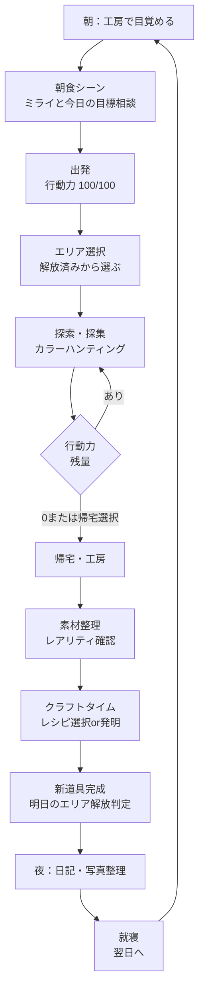
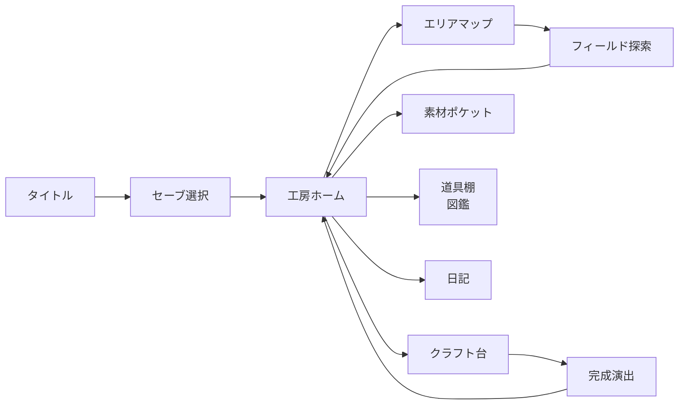

# ひみつ道具工房 / Secret Tool Workshop（仮題）

> **Pitch Document for Nintendo Switch**
> Version 0.1 / 2026-05-26 / Producer: Shooter
>
> 本書は producer が `game-designer` `narrative-designer` `system-designer` `ui-ux-designer` 4視点を統合して執筆した GDD ドラフトです。各セクションに観点タグを併記しています。

---

## 1. エレベーターピッチ（3行）

> **百年引きこもっていた老人のもとに、未来から来た小さな相棒がやってくる。**
> **二人で「ひみつ道具」を発明し、それを鍵に閉ざされた街を一つずつ開けていく――**
> **戦わない、ただ集めて、組み合わせて、世界を取り戻す、優しいハクスラ。**

- **ジャンル**: 収集クラフト・ハクスラ（戦闘なし） / カラーハンティング系
- **プラットフォーム**: Nintendo Switch / Switch 2（携帯モード最適化）
- **プレイ時間**: 1日サイクル 15〜25分 × 約60日分（メイン40時間 + やり込み100時間+）
- **対象**: 7歳〜大人。任天堂ファースト層（『あつまれ どうぶつの森』『ピクミン』『ゼルダ』のライト〜ミドル層）

---

## 2. コアコンセプト

### 2.1 「戦わないハクスラ」という新ジャンル提案
[game-designer 観点]

ハクスラの脳汁（レアドロ、厳選、コレクション欲）は **戦闘の報酬としてではなく、探索と観察の報酬として** 成立する。本作の核は以下3つ：

1. **カラーハンティング** — モンハンの素材厳選的な、色違い・レアリティ違いの収集快楽
2. **クラフト・パズル** — 集めた素材で「ひみつ道具」を組み立てる発明体験
3. **ゲートキーパー進行** — 作った道具が次のエリアの鍵になる、Metroidvania 的開放感

### 2.2 なぜ今このゲームか
- 子供と祖父母が **同じ画面を見て同じ感情を共有できる** ファミリータイトルが希少
- 任天堂IPと衝突しない「**戦闘なし収集クラフト**」というオリジナル領域
- Switch 携帯モードと相性が良い **「1日1サイクル」設計**（あつ森・ピクミンの系譜）
- 「ドラえもん的相棒」というアーキタイプは未開拓のゲーム的鉱脈

### 2.3 プレイヤーが体験する3つの感情
| 感情 | トリガー | 強化要素 |
|---|---|---|
| **発見** | 新エリア開放、レア色素材との遭遇 | カメラ自動演出、SE、相棒のリアクション |
| **創意** | レシピのひらめき、自由なクラフト | レシピノート、相棒の助言 |
| **再会** | 100年で変わった街、過去の住人の痕跡 | 環境ナラティブ、写真コレクション |

---

## 3. キャラクター設定
[narrative-designer 観点]

### 3.1 主人公：**ヨイチ（与一）／ 124歳**
- **設定**: 元・発明家。23歳の時、自作の魔導機械が暴発し恋人を失う。以来100年、自宅工房に引きこもり「外の世界を見ない」と誓った。
- **欲求**: もう一度、何かを作りたい。けれど、誰かを傷つけるのが怖い。
- **恐怖**: 自分の発明が再び誰かを傷つけること。世界が自分の知らない場所になっていること。
- **アーク**: 「閉じこもる老人」→「街の発明おじいちゃん」へ。最終的に "creator" としての自己を取り戻す。
- **ビジュアル設計指針**: ジブリ的な小柄で温かい老人像。白く長い眉毛、丸メガネ、つぎはぎの作業着。普段は猫背だが、クラフト中だけ背筋が伸びる。
- **操作上の特性**: 行動力（体力）が低い。1日の探索時間が短い。代わりに「観察力」が高く、隠し素材を発見しやすい。

### 3.2 相棒：**ミライ（未来）／ 自称10歳・実年齢不明**
- **設定**: 100年後の未来からやってきた、ヨイチの **ひ孫の孫**。「おじいちゃんの曽祖父が引きこもったままだと、未来の家系が成立しない」というタイムパラドックス的事情で派遣された。
- **道具**: 背中の「ポケット」から未来の図面（レシピ）を取り出せる。ただし完成品は出せない（=プレイヤーが作る必要がある）。
- **欲求**: ご先祖を外に連れ出したい。本人は照れて言わないが、ヨイチを尊敬している。
- **恐怖**: ヨイチがまた発明をやめてしまうこと。
- **アーク**: 「お世話係」→「対等な共同発明者」へ。
- **ビジュアル設計指針**: 性別を曖昧に。任天堂的ジェンダーニュートラル（カービィ、ピクミン的）。淡い水色のキャップ、未来素材のオーバーオール、首から下げた小さなホログラム端末。
- **操作上の特性**: ヨイチに同行し、自動で素材を一部ピックアップ。プレイヤーが見落とした素材を「ねえ、あれ！」と指差して教える（オンボーディング兼ナビゲーション）。

### 3.3 サブキャラ群（街の住人）
- **タクシードラゴンの運転手・ガラ婆さん** — 500歳の竜人。ヨイチの若い頃を覚えている唯一の人物。
- **魔法デパート店長・カネダ** — ヨイチが作った道具を委託販売してくれる。
- **学校の校長・サクラ先生（11歳）** — 妖精族なので見た目は子供だが教育者。子供たちにヨイチの工房見学を頼んでくる。
- **地下鉄駅長・無口なゴーレム** — 鉱物素材の情報源。

> **語り口の方針**: 説明セリフを最小化し、環境（街の張り紙、廃墟の落書き、住人の独り言）で100年の変化を語る。

---

## 4. 世界観
[narrative-designer 観点]

### 4.1 舞台：**ノスタルジア市（Nostalgia City）**
ファンタジー世界の「現代」都市。魔法と機械が当たり前に共存している。

| レイヤー | 例 |
|---|---|
| **交通** | ドラゴンタクシー、鉱石燃料の路面電車、空飛ぶ自転車、魔法地下鉄 |
| **商業** | 魔法デパート（食品売場には精霊が陳列、家電売場には魔導コンロ）、屋台 |
| **教育** | 妖精・人間・獣人・小鬼が混合のフリースクール |
| **住居** | 木造長屋とガラス張りタワーが隣接、屋上に小型ダンジョン |
| **自然** | 街の中心に1000年樹、地下に古代遺跡、雲の上に学者の浮島 |

### 4.2 世界観の核となるアイディア
- **「100年は街を変えるのに十分長く、人を変えるには短い」** — ヨイチが知っている店や人の "面影" が至る所に残っている。
- **戦いがない理由**: この世界では200年前に「**大調停**」があり、種族間の物理的衝突が魔法的に禁止された。誰も誰も殴れない。代わりに「**道具による問題解決**」が文化になった。これが「戦わずにクラフトで進む」設定的整合性を担保する。
- **ひみつ道具の定義**: ヨイチ＆ミライが共同で作る「公式に登録されていない発明品」。世に出回っていないので、新しい場所への鍵になりうる。

### 4.3 世界観バイブル（別ファイル予定）
詳細設定は `docs/narrative/worldbuilding.md` に展開予定。

---

## 5. コアループ（1日の流れ）
[game-designer + ui-ux-designer 観点]

### 5.1 1日のフロー図



### 5.2 1サイクルの目標時間配分（15〜25分）
| フェーズ | 時間 | 目的 |
|---|---|---|
| 朝・出発 | 1〜2分 | 今日の目標確認、ナラティブ供給 |
| 探索・採集 | 8〜12分 | カラーハンティングの脳汁ピーク |
| 帰宅・整理 | 2〜3分 | 戦利品確認の達成感 |
| クラフト | 3〜5分 | 創意・発見の喜び |
| 夜の日記 | 1〜3分 | 振り返り、明日の予感 |

### 5.3 なぜ「1日制」か
- **やめどきが明確** = 任天堂層が好む「区切りの良さ」（あつ森・ピクミンの遺伝子）
- **行動力制限** = 老人の身体性を体験的に表現（ナラティブとメカニクスの統合）
- **クラフトタイムの確保** = 「探索だけ」「クラフトだけ」に偏らないリズム
- **携帯モードに最適**: 通勤・寝る前の1サイクル＝1日

### 5.4 短期/中期/長期の報酬構造
| スパン | 報酬 |
|---|---|
| 30秒 | 素材を1つ拾う、色を確認する |
| 5分 | レア色を発見、ミライがリアクション |
| 1日 | 新道具完成、レシピ追加 |
| 1週 | 新エリア開放、街の住人との関係進展 |
| 1ヶ月 | メインプロット進展、ヨイチのアーク前進 |

---

## 6. ひみつ道具システム（解放ゲート設計）
[game-designer 観点]

### 6.1 ひみつ道具ツリー構造
ひみつ道具はカテゴリ別に **5つの系統 × 各10〜15個 = 約60個** を想定。

| 系統 | 例 | 解放するもの |
|---|---|---|
| **移動系** | ジャンプブーツ、グライドマント、ミニ熱気球 | 高所・空中エリア |
| **環境系** | 防寒スーツ、耐熱マスク、酸素ボンベ | 雪山・火山・水中 |
| **感知系** | 素材レーダー、夜目めがね、透視レンズ | 隠しエリア・レア素材検出 |
| **時間系** | 時間スローガジェット、早朝目覚まし、夜行性スーツ | 時間帯限定エリア |
| **コミュニケーション系** | 動物翻訳機、精霊召喚ベル、子供語辞書 | NPCクエスト・隠し依頼 |

### 6.2 ゲートキーパー設計原則
1. **1道具 = 1〜2エリア解放**（過剰に絞らず、選択肢を残す）
2. **同時に複数ルートが開く時期がある**（プレイヤーの自由を確保、メトロイドヴァニアの美徳）
3. **「もう作った道具」も使い続ける**（防寒スーツは雪山以外でも冬季に使う等、廃棄しない設計）
4. **失敗道具の救済**: クラフト失敗品も「分解して別素材」になる

### 6.3 道具の進化（厳選要素）
同じレシピでも素材の色レアリティで **道具自体に色違い・性能違いが発生**。

例：**ジャンプブーツ**
- 標準色（緑素材で作成）: ジャンプ力 +1
- 銀色（希少素材で作成）: ジャンプ力 +2、見た目に金属光沢
- 虹色（極稀素材で作成）: ジャンプ力 +3、トレイル演出、収集図鑑にチェック

→ **「同じ道具を作り直す動機」** が常に存在する。これがハクスラ脳汁の核。

### 6.4 エリア解放マップ（概念図）
```
[工房] - [住宅街] - [魔法デパート]
              \         \
              [学校] - [地下鉄駅]
                  \         \
              [屋上庭園] - [古代遺跡入口]
                              \
                          [雪山] / [火山] / [雲の上の学者島]
                                          \
                                     [最終エリア:大調停の塔]
```

---

## 7. カラーハンティング設計
[system-designer + game-designer 観点]

### 7.1 「カラー」の意味
モンハンの素材ハント快感を **「色違い厳選」** という形で抽出する。

各素材は以下3軸で個体差を持つ：
1. **基本素材タイプ**（例: ホワイトウッド、レッドアイアン、ブルーキノコ）
2. **色レアリティ**（後述5段階）
3. **「印（しるし）」**（極稀に付く星・月・花マークなど、ヨイチが命名できる）

### 7.2 レアリティ5段階と分布
| レアリティ | 名称 | 出現率 | 視覚演出 |
|---|---|---|---|
| ★1 | くすみ | 65% | 通常色、無音 |
| ★2 | 鮮やか | 25% | やや彩度高、軽い光 |
| ★3 | 輝き | 8% | 発光、キラン音 |
| ★4 | 虹彩 | 1.8% | グラデーション、効果音強 |
| ★5 | 神秘 | 0.2% | 周囲が一瞬モノクロ化→対象だけ極彩色、専用BGM断片 |

> **★5発見時のドラマ性** を最重要視する。任天堂のホヌ（『ゼルダ』）的な「発見の儀式感」。

### 7.3 行動力コスト設計（仮）
| 行動 | 行動力消費 |
|---|---|
| 1マス移動（マップ通常） | 0 |
| 1マス移動（雪山・険路） | 1 |
| 通常採集 | 2 |
| 精密採集（レア狙い） | 5 |
| 大型素材伐採・採掘 | 10 |
| エリア間移動（タクシー） | 0（運賃で経済圧） |

行動力 100/日 → 約 15〜25回の採集行動 = 1セッションの分量と一致。

### 7.4 クラフトレシピ設計指針
- **固定レシピ**: メインプロット用ひみつ道具（約60個）はミライが図面を持ってくる
- **発明レシピ**: プレイヤーが素材を自由組合せで投入 → 成功すると「サブ道具」「装飾品」「街の住人へのプレゼント」が完成
- **発明の楽しさ**: 「3素材組合せ = C(50,3) ≈ 19,600通り」の組合せ空間から、約500レシピを隠す
- **ヒント系**: 街の住人の何気ない会話、図書館の本、ミライの夢のメモ等から自然にレシピヒントを供給

### 7.5 数値設計の詳細は別ドキュメントへ
詳細な乱数表・レシピ表・経済モデルは `docs/system-design/color-hunting.md` および `data/balance/*.csv` に展開予定。

---

## 8. 数値設計指針
[system-designer 観点]

### 8.1 プレイ時間設計
| 指標 | 想定値 |
|---|---|
| メインストーリー完走 | 約40時間（60日サイクル × 平均20分 + クラフト時間 + イベント） |
| 全道具コンプリート | 約80時間 |
| 全色違い厳選コンプ | 約200時間（やり込み層向け） |
| 1日プレイ時間（推奨上限） | 1〜2サイクル = 20〜50分 |

### 8.2 成長カーブの考え方
- **指数関数ではなく階段関数**: ハクスラ系の「数値インフレ」を避ける。新道具は **質的変化**（新エリア解放）を主とし、量的強化（数値+10%）は副。
- **エリア解放のテンポ**: 序盤は1〜2日に1エリア、中盤は3〜5日に1エリア、終盤は1週間に1エリア（達成感を維持）。

### 8.3 経済設計の方針
- **通貨**: コイン（街での買い物用）と マナ晶（クラフト触媒）の2軸
- **インフレ抑制**: ショップは「素材を売る」よりも「便利アイテムを買う」（弁当=行動力回復、地図=ヒント）が主用途
- **トレード**: 街住人と「素材交換」可能。ただし★4以上は交換不可（厳選体験を守る）

### 8.4 難易度
- **失敗で失うものを最小化**: 行動力切れで倒れても、その日の採集物の半分は持ち帰れる（ミライが運んでくれる）
- **詰みのない設計**: どのエリアからでも最低1つは新素材が手に入る。常に「何か作れる」状態を保証。

---

## 9. UXフロー概要
[ui-ux-designer 観点]

### 9.1 主要画面構成


### 9.2 探索画面（フィールド）UI 要件
| 要素 | 位置 | 機能 |
|---|---|---|
| 行動力ゲージ | 画面上中央 | 残量視覚化、点滅警告 |
| 時刻＆天候 | 右上 | 時間帯限定素材の判断材料 |
| ミライアイコン | 左下 | タップで「次どこ行く？」相談 |
| 素材インジケータ | 対象に近づくと表示 | 色レアリティを事前に予告（★1-3）、★4-5は近づくまで隠す |
| 採集ボタン | 右下 / A ボタン | 通常採集 |
| 精密採集 | ZL長押し + A | レア狙い、コスト増 |

### 9.3 クラフトUI設計の核
- **「素材を3つ並べて押す」だけの直感操作**
- **失敗してもネタになる**: 「珍妙な何か」が完成し、ミライが面白がる（=失敗が報酬化）
- **図鑑連動**: 一度作った道具は図鑑に登録。色違いはサムネに虹マーク。

### 9.4 オンボーディング
- **チュートリアルは「ミライが教える」形式**: 押し付けがましくないナラティブ統合型
- **最初の3日間で核体験を全網羅**: Day1 採集体験、Day2 クラフト体験、Day3 エリア解放体験
- **大人プレイヤー向け**: 設定でナビゲーションを抑制可能

### 9.5 アクセシビリティ
- **色覚多様性対応**: 「色」が核要素なので、色＋形＋音の3軸で識別可能に
- **フォントサイズ3段階**: 高齢層も意識
- **片手モード**: Joy-Con片手持ちでも採集まで可能
- **テキスト全読み上げ対応**（任天堂タイトル全般のトレンドに合わせる）

### 9.6 詳細UI仕様は別ドキュメントへ
画面別ワイヤーフレームは `docs/ui/screens/` 配下に展開予定。

---

## 10. 任天堂提案ポイント

### 10.1 任天堂IPとの差別化・補完関係
| 任天堂タイトル | 共通する遺伝子 | 本作の独自性 |
|---|---|---|
| 『あつまれ どうぶつの森』 | 1日サイクル、収集、クラフト | **進行型**（ゲート解放）/ **物語性** |
| 『ピクミン』 | 行動力制限、戦利品持ち帰り | **戦闘なし** / **発明クラフト** |
| 『ゼルダ BotW/TotK』 | 道具で世界を開く、発見快感 | **戦闘なし** / **老人主人公** |
| 『マリオメーカー』 | 創意の喜び | **物語に統合された創意** |
| 『ポケモン』 | コレクション・厳選 | **戦闘なし** / **色違いではなく道具違い** |

**ポジショニング**: 「任天堂が持っていない、戦わないハクスラ＋発明クラフト」枠。既存IPと食い合わない、新しい客層を呼べる。

### 10.2 ファミリー訴求ポイント
- **3世代同時プレイの設計**: 子（探索）+ 親（クラフト助言）+ 祖父母（住人との会話を楽しむ）で1台を共有可能
- **暴力ゼロ**: 全年齢対応。海外レーティング（PEGI 3、ESRB E）取得可能設計
- **「おじいちゃん主人公」という稀少性**: 子供にとっての祖父母像、祖父母にとっての自己投影、両方を満たす
- **教育的価値**: 観察、創意、組合せ思考 — 親が買い与える理由を持てる

### 10.3 ビジネスポイント
- **DLC適性高い**: 新エリア・新道具系統の追加が自然（『ピクミン』『あつ森』モデル）
- **Switch 携帯モード相性**: 1サイクル20分は通勤・寝る前に最適
- **myNintendoストア限定商品**: ヨイチ＆ミライのぬいぐるみ、レシピノート文具シリーズ等の物販展開余地大
- **ローカライズ容易性**: ナラティブの文化依存度が低い。色と道具の名前は翻訳しやすい
- **アニメ化適性**: キャラ立てとエピソード性（1日1話）からメディアミックス展開も視野

### 10.4 リスクと対応
| リスク | 対応 |
|---|---|
| 「戦闘なし」が地味に見える | カラーハンティングの ★5 演出を派手にし、PV映え確保 |
| クラフトが作業ゲー化 | 失敗もネタ化、住人リアクションで「作る楽しさ」を強化 |
| 老人主人公の感情移入ハードル | 相棒ミライが「孫視点」を提供、プレイヤーの実年齢を問わない構造 |
| 60日サイクルの中だるみ | 中盤に「ヨイチの過去回想」イベント群を配置、ナラティブで牽引 |

---

## 11. 未解決の Open Questions（次フェーズで詰める）

1. **マルチプレイの可否**: 2人協力（プレイヤー2がミライ操作）を入れるか、シングル特化か
2. **季節サイクル**: あつ森的なリアルタイム連動を入れるか、ゲーム内時間のみか
3. **エンディング**: 「外に出る」だけがゴールでよいか、より大きな物語的クライマックスが必要か（大調停の塔の真相など）
4. **道具60個の具体リスト**: 1個ずつネーミングと効果を game-designer が詰める必要あり
5. **タイトル決定**: 「ひみつ道具」は商標的にドラえもんを想起させすぎる可能性 → narrative-designer & legal で検討

---

## 12. 次のアクション（producer 視点）

| 優先度 | タスク | 担当エージェント |
|---|---|---|
| 高 | 世界観バイブル詳細化 | `narrative-designer` → `docs/narrative/worldbuilding.md` |
| 高 | キャラ設定詳細化（ヨイチ・ミライ） | `narrative-designer` → `docs/narrative/characters/` |
| 高 | ひみつ道具60個リスト案 | `game-designer` → `docs/gdd/tools-list.md` |
| 中 | カラーハンティング数値表（CSV化） | `system-designer` → `data/balance/materials.csv` |
| 中 | 主要画面ワイヤーフレーム | `ui-ux-designer` → `docs/ui/screens/` |
| 中 | 技術選定（エンジン、Switch SDK） | `tech-lead` → `docs/decisions/0001-engine.md` |
| 低 | 任天堂提案用ピッチデッキ（PPT） | `producer` → `docs/pitches/nintendo-pitch.pptx` |

---

> *本書は v0.1 ドラフトです。任天堂提案前に v0.5（タイトル確定・道具リスト確定）、v1.0（プロトタイプ検証反映）への改訂を予定。*
