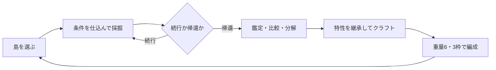

# Voxel Mine ハクスラ化 GDD

## 目指す体験

限られた燃料と敵の攻撃予告を読みながら浮島を掘り、「この素材なら次のビルドが成立する」という発見を持ち帰る。帰還後は拾った特性の断片を組み合わせ、採掘方法そのものを発明する。

強化の中心は単純な火力上昇ではない。ランダムに入手した条件を、地形、対象、手番に合わせて確実に発動させる。プレイヤーは「どこを掘るか」に加え、「いつ、何を、どの順番で掘るか」を考える。

## 二重のゲームループ

### 島での短期ループ

1. 地形、資源、視界内の敵、残燃料を確認する。
2. 装備特性が発動する対象と手番を仕込む。
3. 採掘・伐採・攻撃を行い、条件効果を解決する。
4. 深掘りか帰還かを判断する。

### 港での長期ループ

1. 戦利品を一括鑑定する。
2. 特性素材を厳選し、不要品を分解する。
3. ギア母体へ条件と効果を継承してクラフトする。
4. 重量6・最大3枠でビルドを組む。
5. 欲しい特性が出やすい島へ再出航する。

## 特性素材は「文章の部品」

古代文明の機械に残った命令断片を、条件素材と効果素材として扱う。

- **命令素材**：いつ、何を対象に発動するかを決める。
- **出力素材**：発動した時に何が起きるかを決める。
- **フレーム素材**：ギアの種類、基礎重量、搭載可能な効果系統を決める。

クラフトでは `命令素材 → 出力素材` を一つの特性文にする。

| 命令素材の例 | 出力素材の例 | 完成特性の例 |
|---|---|---|
| 3の倍数手番に | 掘削範囲+1 | 3、6、9手目の範囲+1 |
| 葉を狙った時 | 掘削範囲+1 | 葉中心の伐採範囲+1 |
| 最初の採掘地点で | 毎手1ブロック掘る | 自律削岩杭を設置 |
| 敵の攻撃まで1の時 | 攻撃を1手遅らせる | 危機時に哨戒機を遅延 |
| 鉱石を狙った時 | 連鎖+2 | 鉱脈中心の連鎖強化 |
| 燃料25%以下で | 削岩出力+1 | 終盤だけ過給 |

主要特性は選んだ命令素材と出力素材から100%継承する。ランダム性は素材の入手、品質、副特性候補、軽量変異に残す。クラフト前には完成する主要特性、重量、競合、抽選候補を表示する。

## 素材系統

| 系統 | 主な入手源 | 得意な条件・効果 |
|---|---|---|
| 採掘 | 地形・鉱脈 | 出力、範囲、連鎖、鉱石条件 |
| 樹冠 | 葉・木・生き物 | 葉条件、換金品、連続対象 |
| 古代機械 | 敵・宝箱・遺跡 | 設置、自律、敵遅延、危機条件 |
| 航続 | 生き物・飛空艇残骸 | 燃料、積載、帰還時効果 |
| 測量 | 宝箱・碑文 | 宝箱、希少素材、対象予告 |

各素材は系統、Tier、品質、命令または出力タグ、強度、入手源を持つ。同一タグ・Tier・品質帯はスタックし、細かな数値違いで倉庫を埋めない。

## ギア母体

### 船外作業機

採掘、伐採、連鎖、設置型効果を搭載する。対象ブロックと手番へ直接影響する。

### 飛空艇機関

燃料、積載、敵周期、帰還、査定へ影響する。採掘範囲のような局所効果は搭載できない。

v0.9ではこの2種だけを使う。母体ごとの役割を明確にし、何でも付く万能装備を避ける。

## ビルド例

### 樹冠収穫

- 葉を狙うと範囲+1
- 3の倍数手番に範囲+1
- 一度に複数の葉を壊すと換金品品質上昇

3手目を葉へ合わせ、範囲+2の収穫を狙う。

### 自律採掘基地

- 初回採掘地点へ自律削岩杭
- 鉱石を掘ると杭の次対象を鉱石へ寄せる
- 自動採掘3回ごとに燃料1回復

初手の設置場所が遠征全体の成果を左右する。

### 対哨戒機

- 敵攻撃まで1の時に出力+1
- 敵付近を複数破壊すると攻撃を1手遅延
- 撃破ギアの品質判定を強化

危険な瞬間に敵の周囲を崩して主導権を取る。

### 省燃料連鎖

- 鉱石中心で連鎖+2
- 異なる対象を交互に掘ると次の範囲+1
- 燃料25%以下で出力+1

小さな採掘を重ね、終盤に大きな連鎖を作る。

## 入手・鑑定・分解

- 遠征中は素材の系統アイコンと品質だけを表示する。
- 港へ戻ると具体的な命令文、効果、強度を無料で一括鑑定する。
- 通常ブロックは低確率、特殊ブロックと葉は対応系統、敵は古代機械系を落とす。
- 宝箱は特性素材または完成ギア、敵撃破は完成ギアと特性素材を保証する。
- 不要ギアは校正粉へ分解し、再調律や継承の費用に使う。

鑑定に毎回費用を要求しない。入手直後の喜びを事務作業へ変えず、資源消費はクラフトと再加工へ寄せる。

## UI原則

遠征中に常設する情報は燃料、現在手番、装備ギア3アイコンの発動準備だけとする。特性発動時はギアアイコンの短い点灯、対象地点のリング、`+1` など短い記号だけを出す。説明文や発動ログの常設窓は追加しない。

詳細比較は港へ集約する。素材カードは次の一行で読めるようにする。

`[3手ごと] → [範囲+1]　強度II　周期系`

クラフト画面は、左に命令素材、右に出力素材、中央に完成特性のプレビューを置く。装備比較では変化する条件、重量、期待効果を強調する。

## 成功条件

最大の賭けは「条件素材と効果素材を組み合わせるクラフトが、完成ギアのランダムドロップより面白いか」である。最初のプレイテストでは次を判定する。

- 装備前に発動条件と結果を予想できる。
- 1遠征で条件効果を狙って3回以上発動できる。
- 帰還後に少なくとも1枠を交換したくなる。
- 3遠征以内に異なる条件を組み合わせたビルドが成立する。
- プレイヤーが「次に欲しい素材」を具体的に説明できる。

## 実装段階

### v0.9 特性素材クラフト縦切り

- 素材系統3種：採掘、樹冠、古代機械
- ギア母体2種：船外作業機、飛空艇機関
- 命令素材6種、出力素材6種
- 品質3段階
- 主要特性の確定継承
- 不要ギアの分解と校正粉
- クラフト完成前の効果・重量プレビュー

### v0.10 戦利品循環

- Tierと小幅な数値ロール
- 倉庫、比較、一括分解
- 副特性1個と再調律
- 島ごとのドロップ系統差

### v0.11 ビルド成立

- 樹冠収穫、自律採掘、対哨戒機、省燃料連鎖の4系統
- 条件に対応した島ギミック
- ビルド保存枠3個

### v0.12 周回目標

- 上位島、固有敵、遺跡中枢
- 複数特性ギア
- 希少変異と深度・島変異
- 素材昇華、継承、再調律上限

多段レアリティ、セット装備、強化失敗、装備耐久、無制限再抽選はv0.9へ入れない。最初の縦切りで何が面白いかを測れる範囲に絞る。
