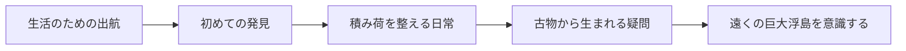

# Voxel Mine — 世界観とフレーバー

## v0.3.1への反映

港の導入、折りたたみ式の「世界の手引き」、6航路の説明、11品目の覚え書きへ反映。発見済み判定は既存のseenを使い、売却後も来歴を読める。リザルトには今回の獲得品の文章だけを掲載する。下記掲載文案の手帳部分は画面用に短く再編集した。

表示専用の変更とし、採掘・燃料・換金・セーブ形式は変更しない。無限資源の理由、島の分離機構、黒い水の正体は明かさない。

## 体験の中心

地上の黒い水を船に積み、空で暮らしの糧を拾う。日々の小さな稼ぎの向こうに、人がまだ踏み込めない巨大な島がある。手元の土や小物から遠い文明へ、好奇心が少しずつ広がる世界を描く。

## 確定設定（ユーザー指定）

- 巨大な浮島から自然に切り出された小さな島が、空を流れてくる。そこから資源を得ることが冒険者の仕事である。
- 巨大な浮島には様々な宝と無限の自然資源がある。中心には古代文明の遺跡があると言われている。**中心遺跡の存在・位置は伝聞、無限の自然資源は世界の前提**として分ける。
- 巨大な浮島への直接進入は、強力な魔物と防衛施設によってことごとく失敗している。
- 人類は流れてくる小さな島から資源を得て生活する。中位の浮島は高級居住区になっている。
- 地上にはほとんど資源がない。ただし飛空艇の燃料となる「黒い水」は豊富にある。
- 冒険者は飛空艇を駆り、浮島で得た資源を生業の糧とする。

## 用語案と設定の境界

| 用語 | 使用範囲 |
|---|---|
| 巨大浮島 | 未踏の資源の源。古代遺跡が中心にあるという言い伝えの対象 |
| 漂流島 | 巨大浮島から自然に切り出された小島の呼称案 |
| 居住浮島 | 高級居住区となった中位の浮島の呼称案 |
| 黒い水 | 地上に豊富にある飛空艇燃料。由来・正体は未設定 |
| 冒険者 | 漂流島で資源を拾う仕事。全員を特別な英雄として扱わない |

以下の接続案と掲載文は、確定設定に沿った**実装上の提案**である。新たな歴史や物理法則の確定には用いない。統治者・身分制度・組合・黒い水の起源・浮遊原理・古代文明の目的は追加確定しない。

## 採掘と背景の接続案

- 黒い水そのものの希少さではなく、飛空艇に積める燃料量が遠征時間を制限する。作業中の滞空に燃料を使うという説明を採用候補とする。帰還分は別に確保し、現行の自動帰還に合わせる。
- 土・石は持ち帰り品ではなく、価値のある発見物を包む層。金具や古物を拾うことで、採掘を「暮らしの役に立つものを見つける仕事」と感じさせる。
- 捕獲の獲得品は羽や抜け殻として描く。生き物の解体や殺害を説明として加えない。
- 現行の六つの行き先は、異なる資源を含む漂流島を探す空域として扱う。航路強化で巨大浮島への上陸が実現したとは書かない。
- 再出航時に同じ形と鉱床を生成する挙動はプロトタイプの都合。資源が同じ島に即時復活する世界法則とはしない。
- リザルトでは今回の積み荷と使った燃料を見せる。「小さな島から生活を持ち帰った」という手応えを補強する。

## 隠しておく問いと情報の順序

遺跡は本当に中心にあるのか。資源はなぜ尽きないのか。島はどうして切り離されるのか。防衛施設は何を守っているのか。黒い水と空の関係はあるのか。**問いへの答えは現段階で決めない。**

序盤は仕事の説明と手触りのある品物、中盤は古物に残る分からない意匠、その先に中心遺跡の言い伝えを置く。短い説明だけで謎を解決せず、品物の見た目とプレイヤーの発見から「もっと知りたい」を生む。遺跡探索・攻撃する魔物・防衛施設は現行版で遊べる機能として案内しない。

これは情報への興味の順序であり、未実装のクエストや結末を約束するプロットではない。

## 掲載用テキスト案

### 港の導入（2文）

巨大な浮島からこぼれた小島が、今日も空を流れてくる。地上の黒い水を船に積み、空で暮らしの糧を拾う――それが冒険者の仕事だ。

### 任意で読む航海手帳（3項目）

**空から来る暮らし**

巨大な浮島から、自然に切り出された小島が流れてくる。冒険者はその土や岩を掘り、暮らしに役立つものを持ち帰る。中位の浮島には高級な住まいが並ぶ。空を渡る小さな積み荷が、人々の生活を支えている。

**届かない中心**

巨大な浮島の資源は尽きず、様々な宝が眠っている。その中心には古代文明の遺跡があるという。だが、直接乗り込む試みは、強力な魔物と防衛施設に阻まれてきた。冒険者の仕事場は、そこから流れ着く小さな島だ。

**地上の黒い水**

地上には資源がほとんど残っていない。ただ、飛空艇を動かす黒い水だけは豊富にある。問題は、水の量ではなく船のタンクだ。作業用の燃料を使い切る前に、何を持ち帰るか。冒険者は毎回、その算段をして空へ出る。

### 品物のフレーバー（各30〜55文字を目安）

| ID | 名前 | 掲載文 |
|---|---|---|
| scrap | 工作部品 | 土に埋もれていた金具や小さな部品。元の姿は分からなくても、まだ船の役に立つ。 |
| copper | 銅 | 赤茶けた鉱石。遠い空から流れ着き、今度はつるはしの先になって空へ戻る。 |
| crystal | 結晶 | 岩のすき間に育った淡い結晶。地上では得がたい輝きも、ここでは土にまみれている。 |
| iron | 鉄 | ずしりと重い鉄鉱石。帰りの積み荷にこれがあるだけで、次の仕事が少し近づく。 |
| gold | 金 | 岩の奥からのぞいた金の粒。居住浮島の窓辺にも、これと同じ輝きが飾られている。 |
| obsidian | 黒曜 | 光を細く返す黒い石。割れた面の鋭さを確かめ、冒険者はそっと布で包んだ。 |
| starcore | 星核 | 星核と呼ばれる奇妙な鉱物。その名を付けた誰かは、石の中に何を見たのだろう。 |
| ancientCoin | 古代貨幣 | 誰の顔かも分からない古い貨幣。使える店はなくても、買い取る人は今もいる。 |
| amber | 空色琥珀 | 空を閉じ込めたような琥珀。これを育んだ木が今もどこかにあるのかは分からない。 |
| bird | 雲羽鳥の羽 | 捕らえた雲羽鳥が残した一枚の羽。土ぼこりを払えば、空で見た色がよみがえる。 |
| beetle | 宝石コガネの殻 | 宝石コガネの抜け殻。主のいない小さな殻にも、居住浮島では値段が付く。 |

品物の用途・取引先などの描写は雰囲気を支える補足案。星核の正体、琥珀の産地や年代は確定しない。

### 六つの航路の短文（各30〜45文字を目安）

| 現行の表示名 | 掲載文 |
|---|---|
| はじまりの草島 | 草の付いた小島が流れる空域。土の下に、今日の暮らしを支える品が眠る。 |
| 青晶の浮島 | 岩間に青い結晶を抱く漂流島。割れ目の向こうに、かすかな光がのぞく。 |
| 鉄雲の岩島 | 重い岩層を抱えて流れる小島。掘り出した鉄は、次の遠征を支える力になる。 |
| 金霞の浮島 | 金を含む小島が漂う空域。土に隠れた輝きは、遠い窓辺へ運ばれてゆく。 |
| 黒曜の高島 | 黒い岩肌を見せる漂流島。切り離される前には、どんな景色の一部だったのか。 |
| 星核の果て | 星核を秘めた小島が流れる空域。手の中の石も、巨大な浮島のほんの欠片だ。 |

## テキスト運用

短文は目的・資源の案内と別に置き、必要な操作情報を詩的表現で置き換えない。任意で読む手帳に背景説明をまとめ、出航や帰還のたびに長文を強制表示しない。人物は未導入のため固有の語り手や台詞は置かず、追加時に欲求・必要・恐れ・変容を定義する。翻訳時に意味が保てるよう、固有の言葉遊びを使わない。
