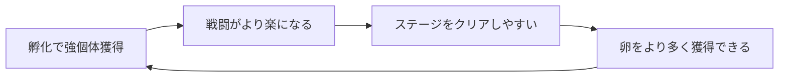
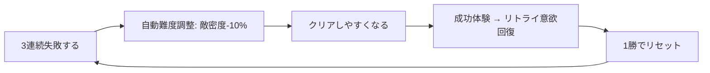
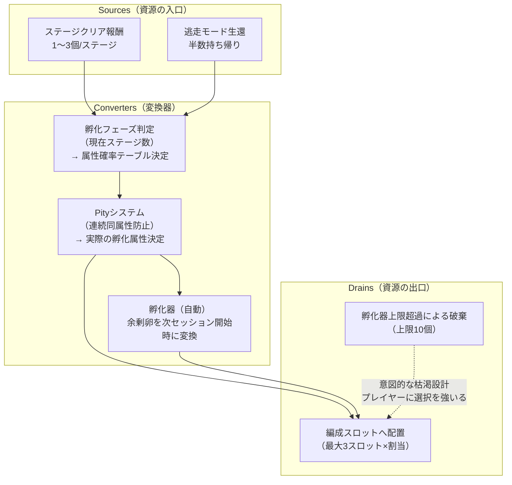

# Dragon Tide — System Design Document

> バージョン: 1.0.0  
> 担当: system-designer  
> 日付: 2026-06-04  
> 対応GDD: `docs/gdd/dragon-tide.md` v0.1  
> データファイル: `data/balance/dragon-tide.json`

---

## 0. この文書の目的

`data/balance/dragon-tide.json` に記載した各数値の「なぜその値か」を設計意図として記述する。数値はコードにハードコードせず、すべてこのJSONから読み込むこと（GDD §2.4のデータ駆動原則）。

調整の権限と手順:
- 数値調整: `data/balance/dragon-tide.json` を直接編集する
- 設計意図の変更が伴う場合: 本文書を同時に更新する
- 実装への橋渡し: `tech-lead` / `gameplay-engineer` に渡す前に本文書を読ませること

---

## 1. フィードバックループ分析

### 1.1 正のフィードバックループ（加速・スノーボール）



**リスク**: 初期に強い組み合わせを発見したプレイヤーが、その後ずっと同じ戦略を使い飽きる。

**制御手段**:
1. **同属性0.8倍ペナルティ**: 単属性特化を弱くし、全属性均等編成を「最適解」に誘導する
2. **段階的な敵の進化**: Stage 6以降、敵も隊形を変えてくる（GDD §6.3）。固定戦略では対応できなくなる
3. **螺旋隊形のスタック上限**: rage_stackは最大+50%で打ち止め。無限強化は許可しない

### 1.2 負のフィードバックループ（安定化・キャッチアップ）



**リスク**: ループが弱すぎると効果なし、強すぎると「失敗しても問題ない」という弛緩を生む。

**制御手段**: 削減は最大40%（3回×10%×最大4段）。40%削減でもステージクリアできない場合は編成の問題であり、プレイヤーに孵化メタループへ誘導する。

### 1.3 両ループの共存確認

| ループ | 強さ | 制御弁 |
|--------|------|--------|
| 正（孵化強化サイクル） | 中程度 | 属性多様性の強制、敵の進化 |
| 負（自動難度調整） | 弱め（非通知） | 40%上限、1勝リセット |

GDDのコアファンタジー「群れになる感覚」を損なわないため、難度調整は**プレイヤーが気づかない形**で実施する。数値の変化を画面に表示すると「ゲームに管理されている感」が出てしまう。

---

## 2. ステージ難易度カーブの設計根拠

### 2.1 敵密度の基準式と意図的な逸脱

GDD §7.2の仮置き式 `5 + N*2` を出発点とした。

| Stage | 式から導かれる値 | 実際の値 | 差異の理由 |
|-------|----------------|---------|-----------|
| 1     | 7               | 7       | 式通り |
| 2     | 9               | 9       | 式通り |
| 3     | 11              | **8**   | 谷: 中型竜初登場の認知負荷を補償 |
| 4     | 13              | 13      | 式通り |
| 5     | 15              | 15      | 式通り |
| 6     | 17              | 17      | 式通り |
| 7     | 19              | **14**  | 谷: 影属性解放の認知負荷を補償 |
| 8     | 21              | 22      | 式+1: 挑戦域突入の明確化 |
| 9     | 23              | 24      | 式+1: 緊張の継続 |
| 10    | 25              | **28**  | 式+3: ボス演出を支えるドラマ的増量 |

**谷（Stage 3, 7）の設計哲学**: Schell『Interest Curve』の原則。新システム（属性・隊形）の学習コストが高いとき、同時に敵密度も上げると認知過負荷（Cognitive Overload）が発生し「操作が難しいのかゲームが難しいのか分からない」状態になる。敵密度をあえて下げることで「新要素の実験場」として機能させる。

### 2.2 敵速度の傾斜設計

```
Stage 1-6: 線形上昇（+0.05/stage程度）
Stage 7以降: 傾斜が急になる（GDD §7.2指定）
```

| Stage | 速度倍率 | 増分 |
|-------|---------|------|
| 1     | 1.00    | -    |
| 5     | 1.15    | +0.04/stage平均 |
| 10    | 1.50    | +0.07/stage平均 |
| 15    | 1.65    | +0.03/stage平均 |

Stage 10-15は傾斜が緩む。Stage 10でカタルシスを達成したあと、Stage 11以降は「速度で圧迫」より「複数中型竜の同時出現」で難度を上げる方針。速度だけで上げると操作感が変わり、Boidsの調整も必要になるため。

---

## 3. 孵化の経済モデル（Sources / Drains / Converters）



### 3.1 Sources（卵の入口）

**ステージクリア報酬（1〜3個）**: 変動報酬をVariableRatio強化スケジュールで運用。平均2個だが「今回は3個！」の瞬間が孵化メタへの期待を高める。ただし最低1個保証で「0個」の失望を排除する。

**逃走モード生還（半数）**: ペナルティなし原則（GDD §7.3）の範囲内で、「失敗しても何か得られる」動機を作る。

### 3.2 Drains（卵の出口）

**孵化器上限（10個）**: 上限を設けることでプレイヤーに「どの卵を使うか」の意思決定を強いる。無限蓄積を許可するとドレインがなくなり、経済が意味を失う（シェル著で「Drainなき経済は必ずインフレする」）。

### 3.3 Converters（確率変換器）

**フェーズ判定**: ステージ進行に応じて確率テーブルが自動遷移。プレイヤーは意識しないが、自然に多様な属性が手に入るよう設計している。

**Pityシステム**: 同一属性の連続出現を防ぐ。「火・火・火・また火…」という体験はフラストレーションを生む（Schell Lens of Chance: 運がスキルを完全に無効化してはならない）。Shuffleバッグ方式で実装することで期待値を保ちつつ体験を平滑化する。

---

## 4. 属性3すくみのバランス検証

### 4.1 「全属性均等編成が最適解になるか？」という問いへの回答

**結論: 均等編成は安定した中道解だが、最適解ではない。**

状況依存の最適解が存在することで「編成を考える意味」が生まれる。

| 編成 | 得意な状況 | 苦手な状況 |
|------|-----------|-----------|
| 火×3特化 (51体) | 氷属性の敵が多い | 影属性の敵に0.8倍 |
| 均等 (17+17+16) | どんな敵にも安定 | 最大ダメージが出ない |
| 火×2+氷×1 | 火→氷特効 + 氷の制御 | 影に偏った敵編成 |

### 4.2 期待ダメージ倍率の計算

敵が均等に3属性（各33%）で出現すると仮定した場合:

**単属性特化（火100%）のケース**:
- vs 氷(33%): 1.5倍  
- vs 火(33%): 0.8倍  
- vs 影(33%): 1.0倍  
- 期待値: (1.5×0.33 + 0.8×0.33 + 1.0×0.33) = **1.089倍**

**均等編成（33%ずつ）のケース**:
- vs 氷(33%): (火1.5×0.33 + 氷0.8×0.33 + 影1.0×0.33) = 1.089倍
- vs 火(33%): (火0.8×0.33 + 氷1.0×0.33 + 影1.5×0.33) = 1.089倍  
- vs 影(33%): (火1.0×0.33 + 氷1.5×0.33 + 影0.8×0.33) = 1.089倍
- 期待値: **1.089倍（どんな敵相手でも安定）**

**理論上の最適（属性読み切り）**:
- 火の敵に対して影特化: 1.5倍
- 読み切りが成功すれば: **1.5倍**（均等比で+37.7%）

この計算から: 均等編成は期待値として単属性特化と同等だが、分散（リスク）が最小。プレイヤーが属性を読み切れれば特化編成が上回る。「読む楽しさ」に報酬を与える設計になっている。

### 4.3 隊形×属性の9パターン選択肢の多様性検証

damageMultiplier比較:

| | 火 | 氷 | 影 |
|---|---|---|---|
| 密集 | 1.6 | 1.2 | 1.4 |
| 散開 | 0.9 | 0.8 | 0.85 |
| 円環 | 1.0 | 0.7 | 0.75 |

**Schell「選択のレンズ」検証**:
- 密集は最もダメージが高い（最大1.6）。なぜ密集を選ばないか？: 分散攻撃時はaoeが小さく群れ処理に不向き。敵が散らばっているときは散開が有効
- 円環は最もダメージが低い（最小0.7）。なぜ使うか？: 防御・継続効果が他の隊形にない価値を持つ
- 9パターンがすべて「どれを選んでも同じ」にならないよう、特殊効果（specialEffect）で質的差別化している

---

## 5. Boidsパラメータの設計根拠

### 5.1 基本パラメータの根拠

プロトタイプ（`prototypes/dragon-tide-boids/index.html`）で検証済みの値を基準とした。

| パラメータ | 値 | 根拠 |
|-----------|----|----|
| perception | 40px | 50体が画面に収まる密度で隣接認知が成立する最小値。これ以上広げると全体が一塊になりすぎる |
| separationRadius | 18px | 竜の描画サイズ（三角形、先端7px）の2.5倍。視覚的に重なりすぎず、程よい群れの密度感 |
| maxSpeed | 160px/s | 3分ステージ中に画面を端から端まで移動（約700px÷160px/s=4.4秒）できる速度。指の動きに追従できる上限 |
| minSpeed | 60px/s | 「ふわっと漂う」感覚を維持する下限。0だと止まって竜らしくない |
| maxForce | 320px/s² | maxSpeed÷fixedStepMs = 160÷0.016 = 10000の約3%。大きすぎると制御不能な動きに |
| wSeparation | 1.8 | 分離を最優先（1.8）。重なりを防ぐことが群れの「生命感」の根幹 |
| wAlignment | 1.0 | 整列は中程度。強くしすぎると「機械的な行進」になる |
| wCohesion | 0.9 | 結束は若干弱め。まとまりすぎると個体の動きが消える |
| wLeader | 1.6 | プレイヤーへの応答性を担保。1.0以下だと追従が遅延し、2.0以上だと「ゴムひも」感が出る |

### 5.2 隊形別オーバーライドの設計

隊形切替はBoidsの重みを動的に変更することで実装する。切替は0.15秒＋最大0.08秒のジッターを加えた個体差演出（GDD §11.3）。

**密集(Tight)の設計意図**:
- wCohesion: 0.9→2.2（+144%）: 強い凝集力で「槍のような一点突破」の視覚を作る
- separationRadius: 18→12px: 重なりを許容して密度を高める。「群れが一つの生き物」に見える瞬間

**散開(Spread)の設計意図**:
- wSeparation: 1.8→2.5（+39%）: 分離力増大。ただし知覚半径も広げ（40→55px）、「バラバラだが連帯している」感覚を保つ
- separationRadius: 18→28px: 目視で間隔が分かるくらい広げる

**円環(Ring)の設計意図**:
- 追加パラメータ `ringRadius: 80px` が必要。gameplay-engineerへ: Boidsの目標位置をリーダー中心から80px円周上に設定し、通常のBoidsルールに重ねる実装を要請する
- ringRadiusはviewHの約11%（720px想定）。画面の中程度のスペースを占める「盾」の視覚

**螺旋(Spiral)の設計意図**:
- `spiralPitch: 25px`（1巻きあたりの間隔）, `spiralRotationSpeed: 1.5 rad/s`（回転速度）
- 1.5 rad/sは約0.24回転/秒。視覚的に「明確に渦を巻いている」と認識できる最低速度
- gameplay-engineerへ: `θ = t * spiralRotationSpeed`, `r = i * spiralPitch / (2π)` で各個体の目標位置を計算する実装を推奨

---

## 6. 報酬スケジュール分析

本作の孵化システムに使われている強化スケジュールの分類と倫理的配慮:

| 報酬 | スケジュール種別 | 倫理的リスク | 緩和措置 |
|------|---------------|------------|--------|
| ステージクリア時の卵（1〜3個） | **変動比率（Variable Ratio）** | 中: 中毒性あり | 最低1個保証。「0個」の絶望を排除 |
| 属性の出現（Pityシステム） | **擬似固定比率** | 低 | 最低確率10%以上、連続同属性防止 |
| 隊形解放（Stage 2,4,10） | **固定比率** | 低: 予測可能 | - |
| 一斉咆哮演出（10ステージ毎） | **固定間隔** | 低: 習慣化 | 3秒中断不可・短いため許容範囲 |

**Variable Ratioの倫理的扱い**: Skinner の変動比率は最も中毒性が高い強化スケジュール。本作ではこれを「卵の数（1〜3個）」の変動に限定し、「属性の抽選」はPityシステムで平滑化する二段構造にする。属性をVariable Ratioにすると「欲しい属性が全然出ない」というフラストレーションが生じるためである。

GDD §12.3にある「ガチャ/課金導線なし」の方針を遵守し、ガチャとしての解釈が生まれる設計（天井・有料リセット等）は一切含まない。

---

## 7. 委譲事項

| 委譲先 | 内容 |
|-------|------|
| `gameplay-engineer` | Boidsの隊形別オーバーライド実装（特にringRadius, spiralの目標位置計算）。データはJSON `boids.formationOverrides` から読み込むこと |
| `gameplay-engineer` | 孵化確率テーブルのShuffleバッグ実装（`hatch._pity_system._implementation_note` 参照）|
| `gameplay-engineer` | 難度自動調整の実装（`difficulty.autoAdjust`。プレイヤー非通知必須）|
| `tech-lead` | JSON読み込みアーキテクチャのレビュー。TypeScriptの型定義生成（zod推奨）|
| `qa-engineer` | Stage 3, 7の「谷」体験の主観評価テスト（「難しかった」vs「新鮮だった」の比率測定）|
| `qa-engineer` | 属性3すくみの期待ダメージ倍率を実ゲームで検証（§4.2の計算値との照合）|

---

## 8. 未解決の数値設計課題

1. **敵の属性配分**: Stage別に敵属性の出現比率テーブルが必要。現時点では未設計。属性相性を意味あるものにするには敵側にも属性の偏りが必要（「氷属性の敵ばかりのステージ」等）
2. **個体のHP/ダメージ基準値**: 本JSONは倍率のみ定義。基準値（base HP, base damage）は別途 `dragon-stats.json` として設計が必要
3. **螺旋隊形のrotationSpeedチューニング**: 1.5 rad/sは机上の計算値。プロトで検証してから微調整
4. **Stage 11以降のループ設計**: GDD §13.1 Open Questions参照。30ステージ以降のリテンション設計は未定
