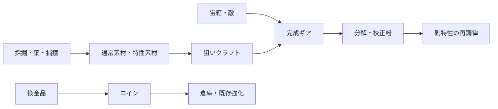

# Voxel Mine 特性素材・ギア数値設計

## 基本制約

- ギア枠：最大3
- 総重量：6
- ギア重量：1〜3
- 条件効果の発動：条件を満たせば100%
- 追加出力上限：+2
- 追加範囲上限：+2
- 敵周期延長上限：+2
- 燃料還元：1操作最大1、1遠征最大6
- 自動効果は別の自動効果を再発動しない

ランダム性の主役は入手した条件と効果の組み合わせにする。範囲+1、敵周期+1など影響が大きい離散値はロールさせない。数値ロールを使う場合も表示は低・標準・高の3帯へ丸める。

## v0.9素材モデル

```text
TraitMaterialStack
  kind: command | output | frame
  family: mining | canopy | ancient
  tag: every_3_turns | leaf_target | first_mine | range_up | auto_mine | enemy_delay ...
  tier: 1..6
  quality: standard | fine | relic
  quantity: 1..99
  sourceIsland
```

同じ `kind/family/tag/tier/quality` はスタックする。個体ごとの1%差を大量保存しない。完成ギアの抽選結果は生成時に確定して保存し、再読込で変化させない。

## 初期命令・出力

### 命令素材

| ID | 条件 | 主な系統 |
|---|---|---|
| every_3_turns | 3の倍数手番 | 採掘 |
| leaf_target | 葉を中心にする | 樹冠 |
| ore_target | 鉱石を中心にする | 採掘 |
| first_mine | 遠征最初の採掘地点 | 古代機械 |
| low_fuel | 燃料25%以下 | 航続 |
| pre_enemy_attack | 敵攻撃まで1 | 古代機械 |

### 出力素材

| ID | 効果 | 共通上限 |
|---|---|---|
| range_up | 範囲+1 | +2 |
| power_up | 出力+1 | +2 |
| chain_up | 連鎖+1〜3 | 既存連鎖上限 |
| auto_mine | 毎手1ブロック自動採掘 | 装備個体ごと1回 |
| fuel_refund | 燃料1回復 | 遠征6 |
| enemy_delay | 攻撃を1手遅延 | +2 |

命令と出力の無効な組み合わせはクラフト前に除外する。`first_mine + auto_mine` のような固有効果は対応フレームだけが受け入れる。

## 品質とTier

v0.9は3品質に限定する。

| 品質 | 主要特性 | 副特性 | 用途 |
|---|---:|---:|---|
| 標準 | 1 | 0 | ビルドの入口 |
| 良質 | 1 | 0〜1 | 中盤の更新 |
| 遺物 | 1 | 1 | 長期目標 |

Tierは到達した島に対応する。ドロップは原則として現在島のTier、20%で1段下。クラフト品のTierは投入フレームと素材の最低Tierに合わせる。

初期の島別品質率：

| 島 | 標準 | 良質 | 遺物 |
|---:|---:|---:|---:|
| 1 | 80% | 20% | 0% |
| 2 | 70% | 28% | 2% |
| 3 | 60% | 36% | 4% |
| 4 | 52% | 41% | 7% |
| 5 | 45% | 45% | 10% |
| 6 | 38% | 48% | 14% |

7回連続で良質以上が出なければ、8回目を良質以上にする。v0.9では複雑なレア度天井を増やさない。

## ドロップ初期値

1遠征60手で特性素材1〜3個を目標にする。

| 入手源 | 特性素材率 | 補足 |
|---|---:|---|
| 通常地形の発見 | 2% | 既存報酬を置換しない。遠征上限3 |
| 鉱石の手動破壊 | 4% | 採掘系重み×3 |
| 連鎖による鉱石破壊 | 1% | 1連鎖塊から最大1個 |
| 葉 | 5% | 樹冠系重み×3 |
| 生き物捕獲 | 8% | 航続・測量系重み×2 |
| 宝箱 | 素材70% / ギア30% | 初回設計図箱は素材も保証 |
| 敵撃破 | ギア1個＋素材1個 | 古代機械系、良質率上昇 |

自律掘削からは特性素材を抽選しない。通常素材と宝箱露出は得られるが、放置による希少素材収集を防ぐ。

## クラフト費用

v0.9は狙った母体を選び、フレーム1個、命令素材1個、出力素材1個と通常素材を使う。

| Tier | 通常素材費 |
|---:|---|
| 1 | 工作部品15 |
| 2 | 工作部品20、銅8、水晶4 |
| 3 | 工作部品25、鉄8、銅10 |
| 4 | 工作部品30、金4、水晶10 |
| 5 | 工作部品35、黒曜5、鉄15 |
| 6 | 工作部品40、星核2、金8 |

現行の工作部品15によるランダム製作は「試作」として残す。試作はフレームと特性がランダムで、標準または良質だけが出る。狙い製作では選んだ主要特性を確定継承する。

## 分解と再加工

- 標準ギア分解：校正粉4
- 良質ギア分解：校正粉8
- 遺物ギア分解：校正粉16
- 副特性の再調律：校正粉8、12、16。1個につき最大3回
- 主要特性は再抽選しない。別の命令と効果で作り直す
- 装備中のギアは分解できない

再調律は副特性だけを対象にし、主要特性を無限抽選する遊びへしない。

## 倉庫

- ギア：24枠
- 特性素材：40スタック、各99個
- 校正粉：通貨扱い、上限9999
- 容量超過時：回収箱8枠へ入り、整理するまで次の出航不可
- ギア倉庫拡張：32枠100コイン、40枠250コイン、48枠500コイン

大量ドロップより、意味のある少数ドロップを優先する。一括比較と一括分解は特性素材導入と同じ段階で用意する。

## パワーカーブ

基準を「60燃料で価値ある破壊・回収60」とする。同Tier良品3枠の遠征平均収量倍率目標：

| 島 | 目標倍率 |
|---:|---:|
| 1 | 1.25 |
| 2 | 1.40 |
| 3 | 1.55 |
| 4 | 1.70 |
| 5 | 1.85 |
| 6 | 2.00 |

全条件が重なった瞬間値は最大2.4、遠征平均は2.0以下を目標にする。重量1は8〜12%、重量2は15〜22%、重量3は25〜35%の平均寄与を基準にする。

## 経済ループ



## 決定性と悪用防止

- 抽選は `worldSeed + tripSerial + sourceId + craftSerial` で確定する。
- 描画、ロード、クラフト画面の開閉では結果を変えない。
- クラフトは結果確定、素材消費、保存を一つの処理にする。
- 自動効果は別の自動効果を再発動しない。
- 範囲+2、出力+2、敵周期+2、燃料還元6/遠征を共通上限にする。
- 連鎖由来の特性素材は1連鎖塊1個、通常破壊枠は1遠征3個まで。
- 最終手番も連鎖、自動効果、敵行動、報酬を解決してから帰還する。

## 計測項目

- 1遠征あたりの装備変更率
- 同じ編成を続けた遠征数
- ギア別装備率、条件発動回数、節約手数
- 燃料1あたりの破壊数と換金価値
- 入手源別の素材・ギア・品質分布
- 分解率、再調律回数、保持されたギアの割合
- 倉庫超過率、回収箱の利用率
- 工房解禁、新島到達、初良質ギアまでの時間

装備率45%超または3%未満、特定2ギアの同時装備35%超、最適ビルドの燃料効率が中央値の1.5倍超を調整警戒線とする。
