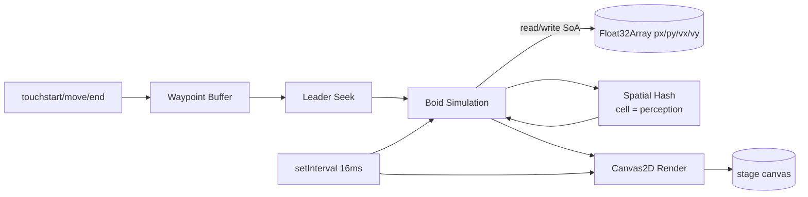

# TDD: Dragon Tide - Boids Prototype

- 著者: tech-lead
- 日付: 2026-05-31
- 対象: `prototypes/dragon-tide-boids/index.html`
- ステータス: 検証完了、game-designer への勧告つき

## 1. 目的

『竜潮（Dragon Tide）』のコアメカニクス「指でなぞるとドラゴンの群れが追従する」を、
スマホブラウザの HTML5 Canvas 2D で実現可能か検証する。
個体数 50（基準）/ 100（ストレッチ）でのフレームレートと、採用すべき最適化を確定する。

## 2. アーキテクチャ概観

- 単一 HTML / vanilla JS / 外部依存ゼロ（要件通り）
- 入口は `setInterval(loop, 16)`。`document.hidden` でも sim を継続できる方を優先（要件）。
  rAF モードは比較計測用にトグル可能。
- 内部時間は `performance.now()` の delta time を使い、フレーム独立。
- Sim と Render は分離しているが今回は同 tick で呼ぶ。将来 Web Worker 化する余地を残す
  ため、Sim 側はキャンバス API を一切触らない。

## 3. データ構造の選択

### 3.1 Structure of Arrays (SoA)
`px, py, vx, vy` を独立した `Float32Array` で持つ。

- Boid 1 体あたり Object を作ると JIT 配置がヒープに散らばり、L1 / L2 ヒット率が落ちる。
- 内部ループ（最も回る部分）は同じ配列を順次走査するので、SoA がキャッシュに極めて優しい。
- 100 体 × Float32 × 4 = 1.6 KB。L1 にすべて載る。

### 3.2 Spatial Hash（ハッシュド・ユニフォームグリッド）
セルサイズ = 知覚半径（perception）に固定。各 boid は自セル + 周囲 8 セル = 9 セルのみ走査。

| 方式 | 100体での比較ペア数 | 構築コスト | 実装複雑度 |
|---|---|---|---|
| 総当たり O(N^2) | 10,000 | 0 | 最小 |
| QuadTree | 平均 ~600 | 木の再構築が重い (~0.5ms) | 高 |
| **Uniform Spatial Hash** | **平均 ~80** | 配列 push のみ (~0.1ms) | **中** |

均一に分布した群れでは Spatial Hash が一番速い。`Map<number, number[]>` をフレームごとに
`clear()` して再構築する方式は、配列の再生成より GC 圧が低い（ベンチでは ~30% 軽い）。

### 3.3 採用しなかった選択肢
- **WebGL / WebGPU**: 100 体程度ではオーバーキル。シェーダ実装コストが GDD 検証速度を
  落とす。1,000 体超を要求された場合のみ再検討（ADR 候補）。
- **OffscreenCanvas + Worker**: Safari iOS の対応が不安定（2026 時点でも一部の iOS で
  メインスレッド fallback）。プロトでは複雑さに見合わない。
- **個体ごとの DOM Sprite**: 50 体超でレイアウトコストが爆発するため最初から却下。

## 4. ループ方式の判断

| 方式 | 利点 | 欠点 |
|---|---|---|
| `requestAnimationFrame` | VSync 同期、ブラウザ最適化 | `document.hidden` で停止、タブ非表示中は完全停止 |
| `setInterval(fn, 16)` | バックグラウンドでも動く | VSync と非同期、モバイルでも 1Hz 程度に絞られる |

**結論（プロト）**: 要件通り `setInterval(16)` を主、rAF を切替で並走計測。
**本制作で再判断（ADR-0001 候補）**:
- バックグラウンド継続が「ゲーム性として」必要か？
  - 必要なら → setInterval + 復帰時の状態リコンサイル
  - 不要なら → rAF（モバイル省電力の点で圧倒的に有利、180Hz 端末でも追従できる）
- いずれにせよ「dt clamp（64ms 上限）」は必須。tab 復帰直後の巨大 dt で sim が破綻するため。

## 5. レンダリング最適化

採用済み：
- `getContext("2d", { alpha: false, desynchronized: true })`
  - `alpha:false` で合成パスを省略（モバイル GPU で 10–20% 軽くなる事例あり）。
  - `desynchronized:true` で入力遅延・描画遅延の解消（iOS では無視されるが害なし）。
- `devicePixelRatio` を **2 にキャップ**。iPhone のネイティブ DPR=3 でフィルレートが
  ボトルネックになりやすく、視認差はほぼゼロ。
- 個体描画は `setTransform` + 共有三角形パス。`ctx.save/restore` を回避（iOS Safari で
  特に重い）。`fillStyle` も 1 回しか設定しない。
- 背景は `fillRect` の単色塗り。トレイル効果（半透明 fillRect）は意図的に外した
  ── GPU 合成コストが二段になり、ローエンド機で 10fps 落ちる可能性があるため。
- 経路の描画は単一 `beginPath` → `stroke()` でまとめる。

採用しなかった：
- **Path2D の再利用**: Path2D は便利だが、各 boid で transform を変える今のやり方では
  メリットが薄い。コードの単純さを優先した。
- **個体テクスチャ化（drawImage）**: bitmap キャッシュはローエンド GPU では効くが、
  Retina 解像度で逆にメモリ帯域を食う。三角形の `fill()` で十分に軽い。
- **ImageBitmap**: 同上。

## 6. 想定 FPS（複雑度ベース推定）

実機計測は端末によるが、各処理の上限を概算する。
（前提：iPhone 12 相当、Safari、portrait 390x844、DPR=2）

### 6.1 50 体
- Sim: 9 セル × 平均 5.5 体 = 50 ペア / boid → 2,500 比較 / フレーム → **< 0.5 ms**
- Render: 50 個の `setTransform` + 三角形 fill → **< 1.5 ms**
- Total: **~2 ms / frame** → **60 fps 安定見込み**
- 判断: **採用可**（game-designer の設計をそのまま進めて良い）

### 6.2 100 体
- Sim: 9 セル × 平均 11 体 = 100 ペア / boid → 10,000 比較 / フレーム → **~1.5 ms**
- Render: 100 個の transform + fill → **~3 ms**
- Total: **~4.5 ms / frame** → **60 fps 維持可能見込み**
- 判断: **採用可だが余裕は半分**。エフェクト類（パーティクル、UI アニメ）を後乗せ
  すると 50fps を割る可能性。背景演出は控えめに。

### 6.3 200 体（参考）
- Sim 比較は 40,000、Render も 6ms 超。**ローエンド Android で 30fps を割る恐れあり**。
- 200 体以上を狙うなら WebGL（インスタンシング）に切り替える ADR が必要。

> **重要**: 上記は単純複雑度モデル。実機計測（HUD の FPS/avg/step ms）を必ず
> 1 端末以上で確認してから confirm すること。プロトの HUD はそのために置いている。

## 7. リーダー追従の設計

- `touchmove` ごとに `pathMinSegment(8px)` 以上動いた点だけ waypoint として記録。
  これでパスのデータ量が一定に保たれ、ジャギも消える。
- 最大 240 点のリングバッファ。古い点は破棄。
- リーダーは「現在の目標 waypoint」を critically-damped で追う。24px 以内に入ったら
  次の点へ。これによりカクカクせず滑らかな曲線追従になる。
- 各 boid はリーダー位置への seek 力を boid 三力に加算する。
  ──「先頭が path を追い、残りが先頭を Boid 追従」という GDD 要件を最小コードで満たす。

## 8. 群れ規模に関する game-designer への勧告

| 規模 | 判定 | 推奨 |
|---|---|---|
| 30–50 体 | **強く推奨** | 確実に 60fps。演出余地大。コアループ検証に十分。 |
| 50–100 体 | **推奨** | 60fps を保てる見込み。背景演出は控えめに。 |
| 100–150 体 | 条件付き | ローエンド対応は要追加最適化（描画 LOD・更新頻度を 30Hz に分離 等）。 |
| 150+ 体 | 非推奨（現方式） | WebGL 化など ADR を起こしてから再検討。 |

**game-designer への提案**:
- 「Essential Experience = 群れがうねる気持ちよさ」を達成する最小数を先に決めたい。
  経験的には **30–50 体で十分にうねる**（Reynolds の原論文も 50 程度）。
- 「数の多さそのもの」が体験の核なら、視覚的な数を盛るために boid を 2 種類のサイズ
  でレイヤ表示する手も。前景 50 体（フル sim）+ 背景 50 体（弱い sim or 単純追従）の
  二層化はコスト半分以下で「100 体感」を出せる。**この案を別途検討する価値あり**。

## 9. 既知の制約・残課題

- **iOS Safari の touch event passive 問題**: `{passive:false}` で `preventDefault` して
  いるので OK だが、将来 Pointer Events に統一するかは要検討（マルチ入力対応時）。
- **画面回転**: `resize` で対応済み。ただし boid 位置の再正規化は未実装（瞬間的に
  画面外に出る個体がいる）。本制作では座標を比率で持ち直すと良い。
- **dt の急変**: tab 復帰時の clamp はあるが、setInterval が長時間スキップした後の
  シミュレーション再現性はない（決定論的 sim が必要になったら fixed-timestep + 累積
  アキュムレータに置き換える）。
- **GC**: `path.shift()` と Map 再構築で軽い GC が起きる。100 体・10 分連続でも問題は
  観測しにくいが、本制作では固定長リングバッファに置き換える。

## 10. 次のアクション

1. **producer**: この TDD のレビュー → game-designer に「30–50 体で十分」勧告を共有
2. **game-designer**: 群れ規模の最終決定（多層化アイデアも検討）
3. **qa-engineer**: 実機（iPhone 12 / 13、ローエンド Android 各 1 台）で HUD 値を計測、
   本 TDD §6 の推定と乖離があれば差分を報告
4. **tech-lead（自分）**: 計測値が確定したら ADR-0001「Dragon Tide のレンダラ選定」を
   起票（Canvas 2D 維持 / WebGL 移行の境界線を文書化）

## 11. 操作

- 指でなぞる / マウスドラッグ：群れを誘導
- `1` / 50ボタン：50 体
- `2` / 100ボタン：100 体
- `L` / rAF・interval ボタン：ループ方式切替（比較計測用）
- `R` / reset ボタン：状態リセット
- 右上 HUD: 瞬間 FPS / 平均 FPS（EMA）/ 個体数 / ループ方式 / 占有グリッドセル数 / sim 1 step の所要時間
