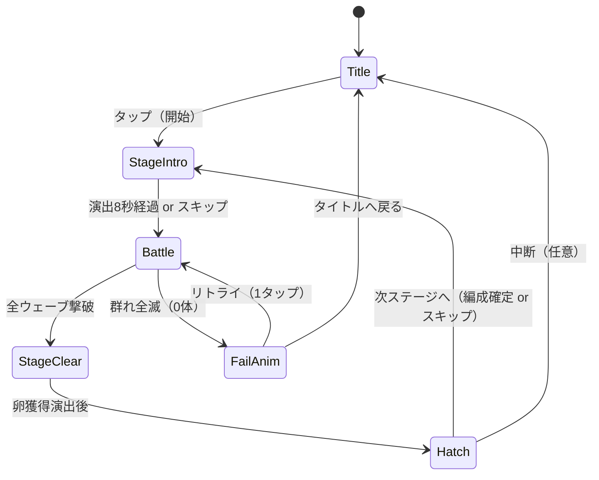

# TDD: 竜潮 / Dragon Tide（本制作）

- 著者: tech-lead
- 日付: 2026-06-04
- 対象: `projects/dragon-tide/`（新規）
- 上位文書: GDD `docs/gdd/dragon-tide.md` v0.1
- 前提検証: TDD `docs/tdd/dragon-tide-boids.md`（プロト、50体で安定60fps確認済み）
- ステータス: ドラフト（producer レビュー待ち）。実装は gameplay-engineer / graphics-engineer に委譲

---

## 0. この文書の位置づけと設計哲学

本TDDは「何を・どの層に・どの順で作るか」を定める実装設計書である。コードそのものは
gameplay-engineer が書く。プロト（`prototypes/dragon-tide-boids/index.html`）で実証済みの
資産（SoA + Spatial Hash + setInterval + dt clamp + setTransform描画）を**そのまま中核に据え**、
ゲーム化に必要な層だけを足す。

### 設計の3原則（Schell のレンズ適用）

1. **テクノロジーのレンズ**: Canvas 2D + vanilla JS は「50体がうねる Essential Experience」を
   既に実現できることが実証済み。これ以上の技術（WebGL / フレームワーク）は現時点で *不可能を増やす*
   （ビルド複雑化・iOS不安定化）だけなので採用しない。境界は §9 と ADR-0001 で文書化。
2. **エレガンスのレンズ**: 9つの属性×隊形効果も、敵Boidsも、卵回収も、**すべて「同じBoids場 +
   パラメタ差し替え」で表現する**。新しいサブシステムを足すのではなく、既存の力場の重みを変える。
   ルールを増やさず体験を増やす。
3. **サプライズの文化**: Boidsは予期せぬ相互作用（群れが千切れる・巴を巻く・敵を包囲する）を生む。
   実装者が「バグっぽいが面白い」挙動を見つけたら *消さずに* game-designer に報告する（§5.5）。

---

## 1. アーキテクチャ概要

### 1.1 レイヤと依存方向

**依存は一方向（外側→内側）。内側はエンジン/DOM/Canvasを知らない。** これにより core は
Node 上で単体テスト可能になり、将来エンジンを差し替えても core は無傷で残る。

```mermaid
flowchart TD
  subgraph Platform["Platform 層（DOM / Web API に依存）"]
    Main[main.js<br/>ブートストラップ]
    LoopDrv[loop.js<br/>setInterval(16ms) driver]
    InputAd[input.js<br/>touch→正規化座標]
    Renderer[renderer.js<br/>Canvas2D 描画]
    WorkerHost[worker-host.js<br/>Worker送受信]
    Storage[storage.js<br/>IndexedDB]
    Haptics[haptics.js<br/>vibrate ベストエフォート]
  end

  subgraph App["App 層（状態管理・調停）"]
    SM[state-machine.js<br/>画面遷移]
    GameCtx[game-context.js<br/>セッション横断状態]
  end

  subgraph Core["Core 層（純粋ロジック / Web API非依存・単体テスト可）"]
    Sim[sim/boids.js<br/>力場計算]
    Hash[sim/spatial-hash.js]
    Path[sim/path.js<br/>ウェイポイント圧縮]
    Combat[combat/resolve.js<br/>属性×隊形 効果適用]
    Element[combat/matrix.js<br/>3すくみ・倍率]
    Stage[progression/stage.js<br/>ウェーブ進行]
    Hatch[progression/hatch.js<br/>孵化・編成]
  end

  subgraph Data["Data 層（純データ・コード非依存）"]
    Balance[(data/balance/dragon-tide.json)]
  end

  Main --> SM
  Main --> LoopDrv
  Main --> InputAd
  Main --> Renderer
  Main --> Storage
  SM --> GameCtx
  LoopDrv -->|update dt| SM
  LoopDrv -->|render| Renderer
  InputAd -->|events| SM
  SM --> Combat
  SM --> Stage
  SM --> Hatch
  WorkerHost -.postMessage.-> Sim
  Sim --> Hash
  Sim --> Path
  Combat --> Element
  Renderer -->|read snapshot| GameCtx
  Storage --> GameCtx
  GameCtx --> Balance
```

**依存ルール（レビュー時の合否基準）**
- Core 層は `window` / `document` / `canvas` / `IndexedDB` / `navigator` を **import も参照もしない**。
- Renderer は Core/App の状態を **読むだけ**（書き込み禁止）。描画は副作用を持たない純関数的に。
- 数値はすべて `data/balance/dragon-tide.json` から注入。Core 層にマジックナンバーを置かない。
- Worker に渡るのは `sim/` 配下のみ（DOM参照ゼロが Worker 化の前提）。

### 1.2 モジュール分割と責務

| モジュール | 層 | 責務 | 依存してよい相手 |
|---|---|---|---|
| `main.js` | Platform | 起動・配線・resize・DPRキャップ | 全Platform, App |
| `loop.js` | Platform | `setInterval(16ms)` 駆動、dt算出+clamp、update/render分離呼び出し | （callbackのみ） |
| `input.js` | Platform | touch/mouse→CSS px正規化、下20%判定、イベント発行 | （callbackのみ） |
| `renderer.js` | Platform | Canvas2D 全描画。竜・線残光・パーティクル・UIアイコン | 読み取り専用snapshot |
| `worker-host.js` | Platform | Worker起動・postMessage・transferable管理 | sim worker |
| `storage.js` | Platform | IndexedDB open/read/write、フォールバック | GameContext schema |
| `haptics.js` | Platform | `navigator.vibrate` 抽象化（非対応時no-op） | なし |
| `state-machine.js` | App | 画面状態と遷移、各stateのupdate/render委譲 | Core各種, GameContext |
| `game-context.js` | App | セッション横断状態（編成・進捗・解放） | Balance |
| `sim/boids.js` | Core | 3力+リーダー引力、積分、speed clamp | spatial-hash, path |
| `sim/spatial-hash.js` | Core | 近傍探索（プロト流用） | なし |
| `sim/path.js` | Core | ウェイポイント記録・圧縮・リングバッファ | なし |
| `combat/resolve.js` | Core | 当たり判定→効果適用→HP/状態更新 | matrix, spatial-hash |
| `combat/matrix.js` | Core | 火氷影3すくみ倍率・9パターン効果定義 | Balance |
| `progression/stage.js` | Core | ウェーブ定義、敵スポーン、勝敗判定 | Balance |
| `progression/hatch.js` | Core | 卵→孵化→スロット編成、解放ゲート | Balance |

> プロトの単一ファイルからの移行: プロトの `step()` → `sim/boids.js`、grid関数 → `sim/spatial-hash.js`、
> `pushPathPoint`/`path` → `sim/path.js`、`drawScene()` → `renderer.js`、loop driver → `loop.js`、
> touch handler → `input.js`。**ロジックは原則そのまま、置き場所だけ整理する**。

### 1.3 データフロー（1tick）

```mermaid
sequenceDiagram
  participant Loop as loop.js (16ms)
  participant SM as state-machine
  participant Worker as sim worker
  participant Buf as Shared/Transfer Buffer
  participant R as renderer

  Loop->>SM: update(dt)
  SM->>SM: 入力キュー消化 → path更新
  SM->>Worker: postMessage(path, leaderTarget, formation, dt)
  Note over Worker: Boids計算（次tickで結果到着 = 1tick遅延許容）
  Worker-->>Buf: 位置/速度を書き戻し
  SM->>SM: combat.resolve(buf, enemies) ※メインスレッド
  Loop->>R: render(snapshot)
  R->>Buf: read px/py/vx/vy
  R->>R: 竜・残光・パーティクル・UI描画
```

**重要な設計判断**: Boids結果は**1tick遅延**で受け取る（postMessageは非同期）。16ms遅延は
GDDの「反応<50ms」要件内（16ms << 50ms）。combat判定はメインスレッドで行う（敵数も含めて
軽量、Worker往復のオーバーヘッドの方が高い）。詳細は §5.4。

---

## 2. ゲームループ設計

### 2.1 駆動方式: `setInterval(16ms)`（rAF不使用）

プロトTDD §4 の結論を**本制作でも踏襲**する。理由はGDD要件「`document.hidden`時も
群れの自律挙動を止めたくない」＋「群密度の音楽化（§2.3）はオーディオ継続が前提」。

```
setInterval(tick, 16) → tick(now):
  dtMs = clamp(now - lastTs, 0, MAX_DT_MS=64)   // タブ復帰の巨大dt対策（プロト実証済み）
  lastTs = now
  dt = dtMs / 1000
  update(dt)      // ロジックのみ。Canvas APIに触れない
  render()        // 描画のみ。状態を書き換えない
```

- **update/render分離は厳守**。update内でCanvas APIを呼ぶことを禁止（レビュー指摘事項）。
  これがWorker化とテスト容易性の両方を担保する。
- dtベースの可変ステップを継続（プロト同様）。決定論が必要になった場合のみfixed-timestep+
  アキュムレータへ移行（§9のリスク項参照）。現状ゲーム性は決定論を要求しない。
- `visibilitychange`で復帰時に `lastTs` をリセット（プロト実装済みパターンを踏襲）。

### 2.2 Update / Render の分離詳細

| フェーズ | 行うこと | 触ってよいもの |
|---|---|---|
| `update(dt)` | 入力消化・path更新・Worker送信・combat解決・state遷移・パーティクル寿命更新 | Core/App状態、Buffer |
| `render()` | 背景・線残光・竜・敵・卵・パーティクル・UIアイコン描画 | Canvas、読み取り専用snapshot |

render は「最後にupdateが書いた状態」を描くだけ。1tick遅延のWorker結果も、来ていなければ
前回値を描く（破綻しない）。

### 2.3 Web Worker分離方針

- **Boids計算（`sim/boids.js`）のみ**をWorkerに載せる。combat・progression・renderはメイン。
- 移行は**フェーズ1では行わない**。プロトはメインスレッド50体で60fps。まずメインで本制作の
  ゲーム化を進め、**敵Boids追加で100体級になり実機で60fpsを割った場合のみ**Worker化する
  （YAGNI: 早すぎる最適化を避ける）。ただし `sim/` をDOM非依存に保つ設計上の準備は最初から行う。
- Worker化トリガー: 実機（ローエンドAndroid 1台）で `step ms` がHUDで4ms超 or avg FPS<55。

---

## 3. ゲームステートマシン

### 3.1 状態遷移図



### 3.2 各ステートの責務

| State | 入る条件 | update責務 | render責務 | 出る条件 |
|---|---|---|---|---|
| `Title` | 起動 / 中断復帰 | アイドルBoids（無入力旋回・GDD§11.5）、セーブ読込済確認 | タイトル空・群れ・開始アイコン | タップ |
| `StageIntro` | ステージ開始 | 群れ初期配置の降下演出（8秒タイマー）、空の色補間 | 降下する群れ・遺跡シルエット | 8秒 or スキップ入力 |
| `Battle` | Intro完了 | 入力→path→Boids、敵スポーン（stage.js）、combat解決、勝敗監視 | 全要素フル描画 | 全ウェーブ撃破 / 0体 |
| `StageClear` | 撃破完了 | 音引き・卵落下演出、報酬確定（hatch.jsへ卵追加） | 卵が降る余韻 | 演出終了 |
| `Hatch` | Clear後 | 卵→スロット編成UI、解放ゲート評価、**セーブ書込**（§7.3） | 編成画面アイコンUI | 確定/スキップ→Intro、中断→Title |
| `FailAnim` | 0体 | 群れが空に溶けるスロー5秒（GDD§7.3）、弱く長い振動、難度自動調整カウンタ更新 | 水墨化・スロー溶解 | リトライ→Battle、戻る→Title |

- 状態は1つだけアクティブ。共通interface `{ enter(ctx), update(dt, ctx), render(r, ctx), exit(ctx) }`。
- 状態間共有データは `game-context.js`（編成・解放進捗・累計ステージ・連続失敗カウンタ）。
- **「残り1体の逃走モード」（GDD§7.3-1）**は `Battle` 内のサブフラグとして扱う（別stateにしない＝
  エレガンス優先）。残数1で `battle.escapeMode=true` にし、Boidsパラメタと描画フィルタを切替える。

---

## 4. 入力システム

### 4.1 イベント取得（プロト流用 + 拡張）

- `touchstart/touchmove/touchend/touchcancel` を `{passive:false}` で `preventDefault`（プロト実証）。
- 座標は **CSS px正規化**（DPR非依存）でCore層へ渡す。Core層はピクセル単位を知らず比率で扱う準備も
  しておく（画面回転対応・プロト残課題§9）。
- マウスは開発用フォールバックとして併設（プロト同様）。

### 4.2 入力モード判定（下20%＝ボタン / それ以外＝ライン）

GDD§10.2「押し始めの位置で操作を判定」。**判定はtouchstartの一度きりで確定**し、moveでは変えない
（指がエリアを跨いでも操作が化けないため＝GDDの誤爆防止要件）。

```
onTouchStart(x, y):
  if (y >= viewH * (1 - BOTTOM_UI_RATIO)):   # BOTTOM_UI_RATIO = 0.20（balance.json）
      mode = "UI"
      ui.hitTest(x, y)        # 属性/隊形/リトライボタン or 属性ラジアル長押し
  else:
      mode = "DRAW"
      path.begin(x, y)        # ライン描画開始
```

- 属性切替はGDD§10.2より**長押しラジアルメニュー**（ライン描画との誤爆防止）。長押し閾値は
  balance.jsonの `attributeRadialHoldMs`。長押し成立前に閾値px以上動いたらDRAWに降格しない
  （UIモードは確定済みなので無視）。
- 隊形トグルは下20%の単タップ。

### 4.3 ウェイポイント圧縮（過密点の間引き）

プロトの `pushPathPoint`（前点から `pathMinSegment`=8px 未満なら捨てる）を**そのまま採用**。
加えて本制作で追加:

- **リングバッファ化**: プロトは `path.shift()`（GC発生・プロトTDD§9既知課題）。本制作は
  固定長 `Float32Array(pathMaxPoints*2)` + head/tail インデックスのリングバッファに置換しGCゼロ化。
- **保持長**: GDD§2.1「画面対角線の1.5倍」。`pathMaxLengthPx = diagonal * 1.5` を超えたら
  古いウェイポイントから消費（leaderが通過した点はtailから破棄）。
- **卵回収（GDD§4.1）**: 卵はpathの引力場で吸い寄せる。卵もleader引力の弱い版を受ける軽量Boidとして
  扱う（新システムを足さずBoids場に相乗り＝エレガンス）。

---

## 5. Boids + パス追従の設計

### 5.1 プロトから引き継ぐ部分 / ゲーム化で足す部分

| 要素 | プロト | 本制作 |
|---|---|---|
| SoA Float32Array (px,py,vx,vy) | あり | **流用**。属性ID/HP/状態フラグ用に `Uint8Array`/`Float32Array` を**並列追加** |
| 3力（分離/整列/結合） | あり | **流用**（重みはbalance.jsonへ外出し） |
| リーダー引力 | あり（単一leader seek） | **流用**＋隊形ごとに引力プロファイルを切替（§6.2） |
| Spatial Hash | あり | **流用**。自軍＋敵軍を同一gridに入れ近傍探索を共有 |
| ウェイポイント圧縮 | あり | **流用**＋リングバッファ化 |
| speed clamp / force clamp | あり | **流用** |
| 属性 | なし | 追加: `elem[i]` (0=火/1=氷/2=影) |
| HP / 撃破 | なし | 追加: `hp[i]`、0で死亡→SoAから論理削除（swap-remove） |
| 隊形 | なし | 追加: formation状態（密集/散開/円環）でフォースプロファイル切替 |
| 敵Boids | なし | 追加: 同じboids.jsを別グループとして駆動（AIはleaderの代わりに簡易目標） |

### 5.2 リーダー追従 + 3ルールの実装方針

プロトの構成（先頭=plyerのfingertip target を critically-damped で追うleader、各boidはleaderへ
seek + 3力）を**踏襲**。本制作の追加は「隊形ごとにleader引力と分離半径を差し替える」だけ:

| 隊形 | wSeparation | wCohesion | leader引力の形 |
|---|---|---|---|
| 密集(Tight) | 低 | 高 | leader点に強く集まる（弾丸的） |
| 散開(Spread) | 高 | 低 | leader周辺に広く分布（面的） |
| 円環(Ring) | 中 | 中 | leaderから半径Rのリング上が目標（接線方向に速度付与で巴を作る） |

- **円環の巴**はleader周囲に目標半径を与え、接線成分を速度に足すだけで生まれる。新ロジック最小。
- 隊形切替はGDD§11.3「個体ごと微小ランダム遅延」。boidごとに `formationLerp[i]` を持ち、
  切替時に `0→1` を個別のランダム速度で補間（重みをlerp）。これで「ざわっ」とした再配置になる。

### 5.3 当たり判定はBoidsと同じgridを共有（§6で詳述）

### 5.4 Web Worker通信プロトコル

**結論: `postMessage` + Transferable（ArrayBuffer転送）を採用。SharedArrayBufferは採用しない。**

| 方式 | 採否 | 理由 |
|---|---|---|
| SharedArrayBuffer | **不採用** | COOP/COEPヘッダ必須。`file://`・単純な静的ホスティングで動かず、オフライン完結（IndexedDB配布/PWA）と相性が悪い。iOS Safariの対応も歴史的に不安定。GDDの「オフライン完結」を阻害する。 |
| postMessage + Transferable | **採用** | バッファ所有権を移譲（コピーなし）。ヘッダ不要・全環境で動く。1tick遅延のみが代償（許容）。 |
| postMessage（構造化クローン） | 不採用 | 毎tickコピーが発生、100体規模で無駄 |

プロトコル（ping-pongでバッファ所有権を往復させる、ダブルバッファ）:

```
メイン→Worker:  { type:"step", dt, pathBuf, leader, formation, buf }   // buf所有権を移譲
Worker→メイン:  { type:"done", buf }                                    // 計算後に返却
```

- メインは2枚のバッファを交互運用し、Worker計算中もrenderは前tickのバッファを読める。
- `pathBuf` はウェイポイントのFloat32Array（圧縮済み・短いのでコピーでも可、または別Transferable）。
- combat結果（HP/死亡）はメインで適用し、次の `step` 送信時にbufに反映してWorkerへ渡す
  （Workerは位置計算に専念、ゲームルールを持たない＝関心の分離）。

### 5.5 サプライズ報告フロー

実装者が「急カーブで群れが千切れて遅延する」「円環が予期せず二重渦になる」等の創発挙動を見つけたら、
バグ修正で潰す前に game-designer へ1行報告（GDD§5「群れの重み・慣性」はまさにこの創発が源泉）。
判断はgame-designerが行う。tech-leadは「面白い挙動を消すコミット」をレビューで止める。

---

## 6. 属性×隊形システム

### 6.1 9パターンの効果（GDD§9.2）

効果定義は **`combat/matrix.js` のテーブル + balance.jsonの数値**で持つ。コードに分岐を9個書かず、
データ駆動の効果記述（effect descriptor）を解釈する1つのresolverで処理する（エレガンス）。

```
effect descriptor 例（balance.json）:
  "fire_tight":   { "shape":"pierce",  "dmg":"X", "status":null }
  "ice_spread":   { "shape":"area",    "dmg":"Y", "status":"slow", "statusDur":"Z" }
  "shadow_ring":  { "shape":"shield",  "dmgReduce":"W" }
  ...（9エントリ）
```

resolverは `shape`（pierce/area/shield）と `status`（slow/freeze/burn/blind/...）を見て適用するだけ。
新しい属性や隊形を足すときもテーブル追記で済む。

### 6.2 3すくみ倍率

`combat/matrix.js`:
```
火→氷 1.5 / 氷→影 1.5 / 影→火 1.5 / 同属性 0.8 / それ以外 1.0   （倍率はbalance.json）
multiplier(attacker, defender) → number
```

### 6.3 当たり判定: Spatial Hash流用 + 円同士

- GDDの「円同士のAABB、Spatial Hash流用」に従う。**Boidsで既に毎tick構築するgridをそのまま使う**
  （自軍・敵軍・卵を同一gridに登録）。専用の衝突用構造を新設しない＝エレガンス。
- ブロードフェーズ: gridの近傍9セルで候補絞り込み。
- ナローフェーズ: 円同士は中心間距離の二乗 ≤ (r1+r2)² で判定（sqrt回避、プロトの距離二乗手法を踏襲）。
- 効果適用: `combat/resolve.js` が候補ペアに対し `matrix.multiplier` × effect descriptor を適用、
  `hp[]` を減算。HP≤0は **swap-remove**（末尾と入れ替えてN--）でSoAから論理削除（O(1)、GCなし）。
- 範囲効果（area）はヒット点周囲セルへの一括適用。盾（shield）は被弾側のdmgReduceとして resolve 内で参照。

---

## 7. IndexedDBセーブ設計

### 7.1 保存データ構造（schema v1）

DB名 `dragon-tide`、object store `save`（keyPath `"slot"`、単一スロット `slot:"main"`）。

```
{
  "slot": "main",
  "schemaVersion": 1,
  "totalStagesCleared": 0,          // 累計ステージ数（解放ゲート判定・GDD§8.1）
  "unlocked": {                     // 解放済みフラグ
    "elements": ["fire"],           // 火→氷→影と増える
    "formations": ["tight"],        // 密集→散開→円環→螺旋
    "compositionScreen": false,     // 編成画面解放（stage5）
    "maxFlockBonus": 0              // 群れ最大数+（stage15で+10）
  },
  "composition": {                  // 群れ編成（スロット3つ・GDD§9.3）
    "slots": [
      { "element": "fire", "count": 17 },
      { "element": null,   "count": 0 },
      { "element": null,   "count": 0 }
    ]
  },
  "incubator": {                    // 孵化器（最大10・GDD§8.3）
    "eggs": [ { "element": "ice", "hatchAtMs": 0 } ]
  },
  "stats": { "failStreak": 0, "playTimeMs": 0 },
  "updatedAt": 0
}
```

- バージョニング: `schemaVersion` を持ち、`onupgradeneeded` とロード時マイグレーションで前方互換を確保。
- 全データ確定はCore層の型（game-context schema）で定義。storage.jsはCore schemaを知るがその逆は無い。

### 7.2 読み書きタイミング

- **読み込み**: 起動時（`main.js`）に1回。失敗/不在なら新規セーブ初期値を `game-context` に投入。
- **書き込み**: **ステージクリア時（`StageClear`→`Hatch`遷移、卵確定後）のみ**（GDD要件）。
  - 理由: Battle中の頻繁な書込はI/Oスパイクで描画を阻害する。クリアは数分に1回で十分。
  - **失敗時は書き込まない**（GDD§7.3-4「卵だけ持ち帰れない」を自然に実現）。
  - 例外: 孵化器の経過時間は書込済みの `hatchAtMs`（絶対時刻）で表現するので、追加書込不要
    （セーブ済みの絶対時刻と現在時刻の差で孵化判定＝アイドル要素を書込なしで成立させる）。

### 7.3 書込の原子性

- 書込は単一トランザクション（`readwrite`）で `save` ストアにput。途中失敗時は前回セーブが残る。
- 書込中フラグでHatch内の二重書込を防止。

---

## 8. 実装フェーズ計画

> 各フェーズ末に動くものをコミット。GDDの「The Toy検証を最優先」を厳守。

### フェーズ1: The Toy検証 ★最優先（敵なし・スコアなし）

GDD§3「敵ゼロ・スコアゼロ・無限の空モードで触り続けるか」。**これがNoなら以降中止**。

- [ ] プロトを `projects/dragon-tide/` へ移植し、§1.2のモジュール分割に再構成
      （ロジックは変えず置き場所だけ整理。動作不変を確認）
- [ ] リングバッファ化したpath（GCゼロ）
- [ ] 隊形3種の切替（密集/散開/円環）と「ざわっ」とした再配置（§5.2）
- [ ] GDD§11の手触り最小実装: 指先の光リング、線の水墨残光（1.2秒）、アイドル旋回
- [ ] 縦持ち固定・SafeArea・下20%UIエリアの枠だけ（ボタンは隊形のみ）
- **検証ゲート**: 社内テスターが平均3分以上触り続けるか（qa-engineerがプレイテスト設計）。
  Yesで初めてフェーズ2へ。

### フェーズ2: 戦闘コア（属性・隊形・勝敗）

- [ ] 属性ID/HPをSoAに追加、3すくみ `matrix.js`
- [ ] 敵Boids（同boids.jsを別グループ駆動、簡易目標AI）
- [ ] 当たり判定（grid共有・円同士）と9パターン効果（descriptor駆動 `resolve.js`）
- [ ] ウェーブ進行 `stage.js`（雑魚×3→中型1、数値はbalance.json）
- [ ] 勝敗（全撃破=Clear / 0体=Fail）、残り1体の逃走モード（Battle内サブフラグ）
- [ ] FailAnim（溶解スロー5秒）、StageClear（卵落下）
- [ ] `state-machine.js` でTitle→Intro→Battle→Clear/Fail の遷移配線

### フェーズ3: 孵化メタループ

- [ ] `hatch.js`（卵獲得→孵化器→スロット編成）
- [ ] 解放ゲート評価（GDD§8.1テーブル、balance.json駆動）
- [ ] IndexedDBセーブ（§7、クリア時書込）
- [ ] 編成画面UI（アイコン中心・テキストゼロ）

### フェーズ4: ゲームフィール磨き

- [ ] 振動全種（§4手触り仕様・iOS非対応フォールバック §9）
- [ ] パーティクル（敵破砕・卵・咆哮カット）。背景演出はFPS監視しつつ追加
- [ ] サウンド連携フック（audio-directorの群密度音楽化・群密度→低音レイヤ数）
- [ ] 直前10秒リプレイ（GDD§7.3-7）※入力ログ記録方式は別途設計
- [ ] 必要なら**ここでWorker化判断**（実機FPS計測後・§2.3トリガー）

---

## 9. 技術リスクと対処

| # | リスク | 影響 | 対処 |
|---|---|---|---|
| R1 | **SharedArrayBuffer 非対応/COOP-COEP必須** | Worker高速通信不可、オフライン配布阻害 | **採用しない**。postMessage+Transferableで回避（§5.4）。1tick遅延は許容。 |
| R2 | **iOS Safari `navigator.vibrate` 非対応** | 触覚フィードバック（GDDの核の一つ）が欠落 | `haptics.js` で抽象化し非対応時no-op。**視覚・聴覚で代替**（GDD§11.4は既にヒット時画面振動なし=視覚主体なので親和性高い）。光リング/フラッシュ/SEを振動の代替チャンネルとして必ず併発させる設計に。将来Web Vibration代替（AudioでのhapticやiOS WebKit新API）が来たらアダプタ差し替えのみ。 |
| R3 | **IndexedDB プライベートブラウジングで失敗/即時消去** | セーブ不能・進捗喪失 | open失敗を検知し**メモリ内セーブにフォールバック**（セッション内は遊べる）。さらにlocalStorage二段フォールバックを試行。プライベート時はUI上に控えめな非テキストアイコン警告（任意）。**セーブ失敗でゲームを止めない**ことを最優先。 |
| R4 | Worker化後のデバッグ困難 | 開発速度低下 | フェーズ4まで遅延導入（YAGNI）。`sim/` をWorker無しでも動く同一APIにしておき、`worker-host` が「Worker版」と「メイン同期版」を切替可能にする（テスト・低スペック端末フォールバック兼用）。 |
| R5 | ローエンドAndroidで100体級60fps割れ | フロー破綻 | 二層化案（前景フルsim+背景簡易・プロトTDD§8）、更新30Hz/描画60Hz分離、DPRキャップ。境界はADR-0001で文書化。 |
| R6 | setInterval可変dtで挙動が端末依存・非決定論 | リプレイ機能(§8 F4)が一致しない | リプレイは「入力ログ再生」でなく「直前10秒の描画状態の倍速再生（録画的）」に倒すか、必要になった時点でfixed-timestep+アキュムレータへ移行（プロトTDD§9既知課題）。フェーズ4で再判断。 |
| R7 | 画面回転で個体が画面外へ | 一瞬の見栄え悪化 | 座標を比率保持に（プロトTDD§9既知課題の本制作対応）。resize時に正規化。 |

### 起票すべきADR

- **ADR-0001**: Dragon Tide のレンダラ／同時体数の境界（Canvas2D維持 vs WebGL移行）。実機計測確定後。
- **ADR-0002**: Worker通信方式の確定（postMessage+Transferable採用、SAB不採用の根拠）。§5.4の内容を正式化。

---

## 10. レビュー観点（実装エージェント向けチェックリスト）

実装PRはこの観点でレビューする:

- [ ] Core層（`sim/` `combat/` `progression/`）に `window/document/canvas/IndexedDB/navigator` 参照がない
- [ ] update内でCanvas APIを呼んでいない（update/render分離の厳守）
- [ ] 数値が `data/balance/dragon-tide.json` に外出しされ、コードにマジックナンバーがない
- [ ] ユーザー向け文字列ゼロ（テキストレス要件）。やむを得ない場合はi18n経由
- [ ] path・grid・パーティクルがフレーム毎にGCを起こさない（リングバッファ/プール/swap-remove）
- [ ] 命名が省略されていない、意図を表す（CLAUDE.md規約）
- [ ] Core層に単体テスト（`tests/`）がある（DOM非依存だからこそ書ける）
- [ ] 9効果が分岐の羅列でなくdescriptor駆動で実装されている（エレガンス）
- [ ] 「面白い創発挙動」を潰すコミットでないか（サプライズ文化・§5.5）

---

## 11. 次のアクション

1. **producer**: 本TDDレビュー、フェーズ1着手の承認
2. **system-designer**: `data/balance/dragon-tide.json` 雛形作成（隊形重み・3すくみ倍率・9効果descriptor・ウェーブ・解放ゲート）
3. **gameplay-engineer**: フェーズ1（The Toy）着手 — プロト移植 + 隊形3種 + 手触り最小
4. **graphics-engineer**: GDD§11手触り仕様のCanvas2D実装可能性確認（光リング・水墨残光・溶解スロー）
5. **qa-engineer**: フェーズ1検証ゲート（平均3分プレイテスト）の測定設計
6. **tech-lead（自分）**: 実機計測確定後 ADR-0001 / ADR-0002 起票

---

*— end of TDD（本制作）—*
